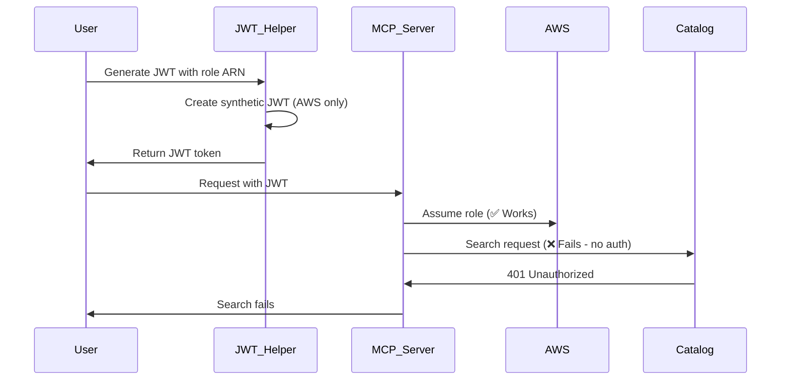
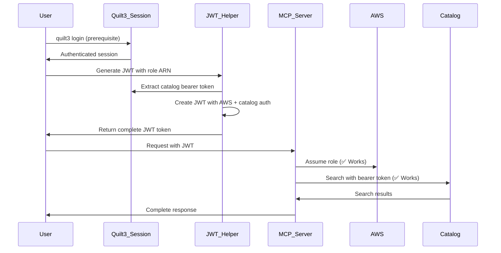

# Design Document: JWT Catalog Authentication Fix

## Overview

The Quilt MCP server currently suffers from incomplete authentication in stateless environments. While JWT tokens successfully provide AWS role credentials for S3/IAM operations, they lack the catalog bearer tokens required for search and package operations. This design addresses the authentication gap by extracting real catalog authentication from active quilt3 sessions and embedding it within JWT tokens.

The solution transforms JWT tokens from AWS-only authentication carriers into complete authentication bridges that support both AWS operations and catalog operations in stateless environments.

## Architecture

### Current Authentication Flow (Incomplete)



### Proposed Authentication Flow (Complete)



## Components and Interfaces

### JWT Helper Script Enhancement

**Location**: `scripts/tests/jwt_helper.py`

**New Functions**:

```python
def extract_catalog_authentication() -> CatalogAuth:
    """Extract catalog authentication from active quilt3 session.
    
    Returns:
        CatalogAuth containing bearer token, catalog URL, and registry URL
        
    Raises:
        AuthenticationError: If no active session or extraction fails
    """

def validate_quilt3_session() -> SessionValidation:
    """Validate that quilt3 session is active and authenticated.
    
    Returns:
        SessionValidation with status and configuration details
    """

def generate_complete_jwt(
    role_arn: str,
    secret: str,
    catalog_auth: Optional[CatalogAuth] = None,
    auto_extract: bool = True,
    **kwargs
) -> str:
    """Generate JWT with both AWS and catalog authentication."""
```

**Enhanced JWT Claims Structure**:

```python
{
    # Existing AWS claims
    "iss": "mcp-test",
    "aud": "mcp-server", 
    "iat": 1706479600,
    "exp": 1706483200,
    "sub": "test-user",
    "role_arn": "arn:aws:iam::123456789:role/TestRole",
    "session_tags": {...},
    
    # New catalog claims
    "catalog_token": "eyJ0eXAiOiJKV1QiLCJhbGciOi...",
    "catalog_url": "https://nightly.quilttest.com",
    "registry_url": "https://nightly-registry.quilttest.com"
}
```

### JWT Authentication Service Enhancement

**Location**: `src/quilt_mcp/services/jwt_auth_service.py`

**New Methods**:

```python
def setup_catalog_authentication(self) -> None:
    """Configure catalog authentication from JWT claims.
    
    Extracts catalog bearer token, URLs from JWT and configures
    quilt3 session for catalog operations.
    """

def get_catalog_session(self) -> requests.Session:
    """Get authenticated session for catalog operations.
    
    Returns:
        Configured requests.Session with catalog bearer token
    """

def validate_complete_authentication(self) -> AuthValidation:
    """Validate both AWS and catalog authentication are available.
    
    Returns:
        AuthValidation indicating which auth types are available
    """
```

**Integration Points**:

- Extend existing `get_boto3_session()` method to also setup catalog auth
- Add catalog authentication setup to service initialization
- Provide fallback behavior when catalog auth is unavailable

### Quilt Service Integration

**Location**: `src/quilt_mcp/services/quilt_service.py`

**Enhanced Methods**:

```python
def configure_from_jwt_auth(self, jwt_service: JWTAuthService) -> None:
    """Configure quilt service using JWT authentication.
    
    Sets up both AWS credentials and catalog authentication
    from JWT claims for stateless operation.
    """

def get_authenticated_session(self) -> requests.Session:
    """Get session with appropriate authentication.
    
    Returns session configured for current auth context
    (local session or JWT-based authentication).
    """
```

## Data Models

### CatalogAuth Data Structure

```python
@dataclass
class CatalogAuth:
    """Catalog authentication information extracted from quilt3 session."""
    bearer_token: str
    catalog_url: str
    registry_url: str
    expires_at: Optional[datetime] = None
    
    def is_expired(self) -> bool:
        """Check if catalog authentication is expired."""
        if not self.expires_at:
            return False
        return datetime.now(timezone.utc) > self.expires_at
    
    def to_jwt_claims(self) -> Dict[str, str]:
        """Convert to JWT claims format."""
        return {
            "catalog_token": self.bearer_token,
            "catalog_url": self.catalog_url,
            "registry_url": self.registry_url
        }
```

### SessionValidation Data Structure

```python
@dataclass
class SessionValidation:
    """Validation result for quilt3 session status."""
    is_authenticated: bool
    catalog_url: Optional[str] = None
    registry_url: Optional[str] = None
    error_message: Optional[str] = None
    suggested_command: Optional[str] = None
    
    def get_login_command(self) -> str:
        """Get the quilt3 login command for current configuration."""
        if self.catalog_url:
            return f"quilt3 login {self.catalog_url}"
        return "quilt3 login"
```

### AuthValidation Data Structure

```python
@dataclass
class AuthValidation:
    """Validation result for complete authentication status."""
    has_aws_auth: bool
    has_catalog_auth: bool
    aws_role_arn: Optional[str] = None
    catalog_url: Optional[str] = None
    missing_auth_types: List[str] = field(default_factory=list)
    
    @property
    def is_complete(self) -> bool:
        """Check if both authentication types are available."""
        return self.has_aws_auth and self.has_catalog_auth
    
    def get_error_message(self) -> str:
        """Get descriptive error message for missing authentication."""
        if not self.missing_auth_types:
            return "Authentication is complete"
        
        missing = ", ".join(self.missing_auth_types)
        return f"Missing authentication: {missing}"
```

## Correctness Properties

*A property is a characteristic or behavior that should hold true across all valid executions of a system-essentially, a formal statement about what the system should do. Properties serve as the bridge between human-readable specifications and machine-verifiable correctness guarantees.*

Based on the prework analysis, I'll now convert the testable acceptance criteria into properties. After reviewing all properties for redundancy, I can consolidate several related properties:

**Property Reflection:**
- Properties 1.1-1.5 (JWT Helper extraction) can be combined into comprehensive extraction properties
- Properties 3.1-3.5 (MCP Server processing) can be consolidated into authentication routing properties  
- Properties 4.1-4.5 (AWS compatibility) can be combined into backward compatibility properties
- Properties 5.1-5.5 and 6.1-6.5 (testing) can be consolidated into comprehensive test validation properties
- Properties 7.1-7.5 (error handling) can be combined into consistent error messaging properties
- Properties 8.1-8.5 (backward compatibility) overlap with 4.1-4.5 and can be consolidated

**Property 1: Complete JWT Generation**
*For any* active quilt3 session with valid catalog authentication, generating a JWT token should produce a token containing both AWS role information and catalog authentication claims (bearer token, catalog URL, registry URL)
**Validates: Requirements 1.1, 1.3, 1.4**

**Property 2: Session Validation and Error Guidance**
*For any* system state where quilt3 session is missing or invalid, JWT generation should fail with specific error messages that include the exact `quilt3 login` command needed for resolution
**Validates: Requirements 1.2, 1.5, 2.1, 2.2, 2.3**

**Property 3: Registry Selection Consistency**
*For any* quilt3 configuration with multiple registries, JWT generation should consistently use the default registry or provide clear registry selection options
**Validates: Requirements 2.4, 2.5**

**Property 4: Complete Authentication Processing**
*For any* JWT token containing both AWS and catalog authentication claims, the MCP server should correctly extract and use appropriate credentials for each operation type (AWS credentials for S3/IAM operations, catalog bearer token for search/package operations)
**Validates: Requirements 3.1, 3.2, 3.3, 3.5, 4.2, 4.3, 4.4**

**Property 5: Authentication Error Handling**
*For any* JWT token missing either AWS or catalog authentication, the MCP server should return specific error messages distinguishing between the missing authentication types
**Validates: Requirements 3.4, 4.5, 7.2, 7.5**

**Property 6: Backward Compatibility Preservation**
*For any* legacy JWT token containing only AWS authentication, the MCP server should continue supporting S3/IAM operations while gracefully degrading catalog operations with informative errors
**Validates: Requirements 4.1, 8.1, 8.2, 8.3**

**Property 7: Complete Test Validation**
*For any* test execution in stateless mode, the test infrastructure should validate both AWS and catalog authentication are present in JWT tokens and verify that both S3 operations and catalog operations succeed
**Validates: Requirements 5.1, 5.3, 5.4, 6.1, 6.2, 6.3, 6.5**

**Property 8: Test Error Reporting**
*For any* test failure due to authentication issues, the test infrastructure should provide specific remediation steps and distinguish between AWS and catalog authentication failures
**Validates: Requirements 5.2, 5.5, 6.4**

**Property 9: Consistent Error Messaging**
*For any* authentication failure scenario (JWT generation, session validation, or operation execution), the system should provide step-by-step resolution instructions appropriate to the specific failure type
**Validates: Requirements 7.1, 7.3, 7.4**

**Property 10: Deployment Compatibility**
*For any* existing AWS-only JWT workflow, system updates should preserve current functionality and maintain existing test coverage
**Validates: Requirements 8.4, 8.5**

<function_calls>
<invoke name="prework">
<parameter name="featureName">jwt-catalog-authentication-fix

## Error Handling

### JWT Generation Errors

**Session Validation Failures**:
- Missing quilt3 session: Clear instructions to run `quilt3 login`
- Expired session: Detection and re-authentication guidance
- Invalid configuration: Specific configuration problem identification

**Catalog Extraction Failures**:
- Bearer token extraction failure: Detailed error with session status
- URL extraction failure: Configuration validation and correction guidance
- Permission issues: Clear explanation of required access levels

**Error Message Format**:
```
❌ JWT Generation Failed: [Specific Reason]

Resolution Steps:
1. [Specific action required]
2. [Verification step]
3. [Retry instruction]

Example Command:
  quilt3 login https://nightly.quilttest.com
```

### MCP Server Authentication Errors

**JWT Processing Errors**:
- Invalid JWT format: Token structure validation errors
- Missing claims: Specific identification of missing authentication components
- Expired tokens: Clear expiration detection and renewal guidance

**Operation-Specific Errors**:
- AWS operations without AWS auth: "Missing AWS role authentication in JWT"
- Catalog operations without catalog auth: "Missing catalog bearer token in JWT"
- Mixed authentication scenarios: Clear routing error explanations

**Error Response Format**:
```json
{
  "error": {
    "code": "missing_catalog_auth",
    "message": "Catalog operations require bearer token authentication",
    "details": {
      "operation": "search_catalog",
      "required_claims": ["catalog_token", "catalog_url"],
      "available_claims": ["role_arn", "session_tags"],
      "resolution": "Regenerate JWT with catalog authentication"
    }
  }
}
```

### Graceful Degradation

**Partial Authentication Scenarios**:
- AWS-only JWT: S3/IAM operations work, catalog operations return informative errors
- Catalog-only JWT: Catalog operations work, AWS operations return specific errors
- No authentication: All operations fail with clear authentication requirements

**Backward Compatibility**:
- Legacy JWT tokens continue working for supported operations
- New features gracefully unavailable with clear upgrade paths
- Existing workflows preserved during authentication enhancements

## Testing Strategy

### Dual Testing Approach

The testing strategy employs both unit tests and property-based tests as complementary approaches:

**Unit Tests**: Focus on specific examples, edge cases, and integration points
- Specific JWT generation scenarios with known inputs/outputs
- Error condition testing with controlled failure scenarios
- Integration testing between JWT helper and MCP server components
- Backward compatibility verification with legacy JWT formats

**Property-Based Tests**: Verify universal properties across all inputs
- JWT generation consistency across various session states
- Authentication routing correctness for all operation types
- Error message consistency across all failure scenarios
- Backward compatibility preservation across all legacy scenarios

### Property-Based Testing Configuration

**Testing Library**: Use `hypothesis` for Python property-based testing
**Test Configuration**: Minimum 100 iterations per property test
**Test Tagging**: Each property test references its design document property

**Example Property Test Structure**:
```python
@given(session_state=session_strategies(), role_arn=role_arn_strategy())
def test_complete_jwt_generation_property(session_state, role_arn):
    """
    Feature: jwt-catalog-authentication-fix, Property 1: Complete JWT Generation
    
    For any active quilt3 session with valid catalog authentication,
    generating a JWT token should produce a token containing both AWS role
    information and catalog authentication claims.
    """
    # Test implementation
```

### Test Categories

**JWT Generation Tests**:
- Property tests for extraction consistency across session variations
- Unit tests for specific error scenarios and edge cases
- Integration tests for end-to-end JWT creation and validation

**MCP Server Authentication Tests**:
- Property tests for authentication routing across operation types
- Unit tests for specific authentication failure scenarios
- Integration tests for complete request/response cycles

**Backward Compatibility Tests**:
- Property tests for legacy JWT support across all operation types
- Unit tests for specific migration scenarios
- Integration tests for mixed authentication environments

**Error Handling Tests**:
- Property tests for error message consistency across failure types
- Unit tests for specific error scenarios and recovery paths
- Integration tests for error propagation through the system

### Test Infrastructure Requirements

**Prerequisites Validation**:
- Automated checks for quilt3 session before JWT generation
- Clear setup instructions when prerequisites are missing
- Fast failure with specific remediation steps

**Stateless Testing**:
- Docker-based testing environment without local quilt3 session
- JWT-only authentication validation
- Complete operation testing (both AWS and catalog operations)

**Test Data Management**:
- Synthetic JWT generation for controlled testing scenarios
- Mock catalog responses for isolated unit testing
- Real integration testing with actual catalog authentication

This comprehensive testing approach ensures both specific correctness (unit tests) and general correctness (property tests) while maintaining backward compatibility and providing clear error guidance.