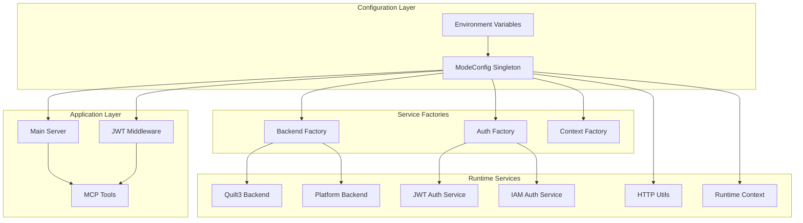
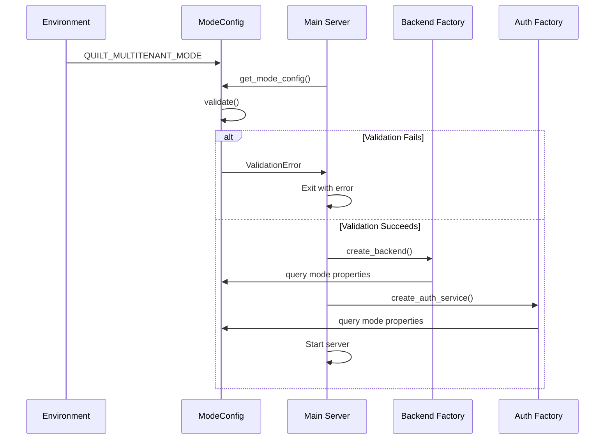

# Design Document: Mode Configuration Consolidation

## Overview

This design consolidates scattered mode detection logic into a single `ModeConfig` abstraction that manages all deployment mode decisions through the `QUILT_MULTITENANT_MODE` boolean environment variable. The design eliminates three redundant environment variables and provides a centralized, validated configuration system that enforces security boundaries between local development and multitenant production modes.

The implementation follows a hard switch approach with no backward compatibility requirements, allowing for complete simplification of the configuration system while maintaining the ability to run in both local development and multitenant production modes.

## Architecture

### Core Components



### Mode Configuration Flow



## Components and Interfaces

### ModeConfig Singleton

**Location:** `src/quilt_mcp/config/mode_config.py`

```python
class ModeConfig:
    """Centralized mode configuration management."""
    
    def __init__(self):
        self._multitenant_mode = self._parse_bool(
            os.getenv("QUILT_MULTITENANT_MODE"), default=False
        )
    
    @property
    def is_multitenant(self) -> bool:
        """True if running in multitenant production mode."""
        return self._multitenant_mode
    
    @property
    def is_local_dev(self) -> bool:
        """True if running in local development mode."""
        return not self._multitenant_mode
    
    @property
    def backend_type(self) -> Literal["quilt3", "graphql"]:
        """Backend type based on deployment mode."""
        return "graphql" if self.is_multitenant else "quilt3"
    
    @property
    def requires_jwt(self) -> bool:
        """True if JWT authentication is required."""
        return self.is_multitenant
    
    @property
    def allows_filesystem_state(self) -> bool:
        """True if filesystem state persistence is allowed."""
        return self.is_local_dev
    
    @property
    def allows_quilt3_library(self) -> bool:
        """True if quilt3 library session usage is allowed."""
        return self.is_local_dev
    
    @property
    def tenant_mode(self) -> Literal["single-user", "multitenant"]:
        """Tenant mode for context factory."""
        return "multitenant" if self.is_multitenant else "single-user"
    
    @property
    def requires_graphql(self) -> bool:
        """True if GraphQL backend is required."""
        return self.is_multitenant
    
    @property
    def default_transport(self) -> Literal["stdio", "http"]:
        """Default transport protocol based on deployment mode."""
        return "http" if self.is_multitenant else "stdio"
    
    def validate(self) -> None:
        """Validate configuration for current mode."""
        if self.is_multitenant:
            self._validate_multitenant_config()
    
    def get_validation_errors(self) -> List[str]:
        """Return list of configuration validation errors."""
        errors = []
        if self.is_multitenant:
            errors.extend(self._get_multitenant_validation_errors())
        return errors

def get_mode_config() -> ModeConfig:
    """Get singleton ModeConfig instance."""
    global _mode_config_instance
    if _mode_config_instance is None:
        _mode_config_instance = ModeConfig()
    return _mode_config_instance
```

### Platform Backend Stub

**Location:** `src/quilt_mcp/backends/platform_backend.py`

```python
class Platform_Backend(QuiltOps):
    """Platform GraphQL backend (stub implementation)."""
    
    def __init__(self):
        pass
    
    def list_packages(self, registry: str) -> List[PackageInfo]:
        raise NotImplementedError(
            "Platform GraphQL backend not yet implemented. "
            "Use QUILT_MULTITENANT_MODE=false for local development."
        )
    
    # All other QuiltOps methods raise NotImplementedError with same message
```

### Updated Backend Factory

**Location:** `src/quilt_mcp/ops/factory.py`

```python
class QuiltOpsFactory:
    @staticmethod
    def create() -> QuiltOps:
        """Create QuiltOps instance based on mode configuration."""
        mode_config = get_mode_config()
        
        if mode_config.backend_type == "quilt3":
            session_info = QuiltOpsFactory._detect_quilt3_session()
            if session_info is not None:
                return Quilt3_Backend(session_info)
            raise AuthenticationError("No valid quilt3 session found")
        
        elif mode_config.backend_type == "graphql":
            return Platform_Backend()
        
        raise AuthenticationError(f"Unknown backend type: {mode_config.backend_type}")
```

### Updated Context Factory

**Location:** `src/quilt_mcp/context/factory.py`

```python
class RequestContextFactory:
    def __init__(self, mode: str = "auto") -> None:
        mode_config = get_mode_config()
        self.mode = mode_config.tenant_mode
    
    def _create_auth_service(self) -> AuthService:
        mode_config = get_mode_config()
        runtime_auth = get_runtime_auth()
        
        if runtime_auth and runtime_auth.access_token:
            return JWTAuthService()
        
        if mode_config.requires_jwt:
            raise ServiceInitializationError(
                "AuthService", 
                "JWT authentication required but missing."
            )
        
        return IAMAuthService()
```

## Data Models

### Configuration State

```python
@dataclass(frozen=True)
class ModeConfigState:
    """Immutable configuration state."""
    multitenant_mode: bool
    jwt_secret: Optional[str]
    jwt_issuer: Optional[str]
    jwt_audience: Optional[str]
    
    @property
    def is_valid_multitenant(self) -> bool:
        """Check if multitenant configuration is complete."""
        return (
            self.multitenant_mode and
            self.jwt_secret is not None and
            self.jwt_issuer is not None and
            self.jwt_audience is not None
        )
```

### Validation Results

```python
@dataclass
class ValidationResult:
    """Configuration validation result."""
    is_valid: bool
    errors: List[str]
    warnings: List[str]
    
    def raise_if_invalid(self) -> None:
        """Raise ConfigurationError if validation failed."""
        if not self.is_valid:
            raise ConfigurationError(f"Invalid configuration: {'; '.join(self.errors)}")
```

## Correctness Properties

*A property is a characteristic or behavior that should hold true across all valid executions of a system-essentially, a formal statement about what the system should do. Properties serve as the bridge between human-readable specifications and machine-verifiable correctness guarantees.*

Now I need to use the prework tool to analyze the acceptance criteria before writing the correctness properties:

### Property 1: Mode Configuration Parsing

*For any* valid boolean environment variable value, ModeConfig should correctly parse `QUILT_MULTITENANT_MODE` and set the corresponding mode properties (is_multitenant, is_local_dev)
**Validates: Requirements 1.1, 1.2**

### Property 2: Singleton Pattern Consistency

*For any* sequence of calls to `get_mode_config()`, all calls should return the same instance object
**Validates: Requirements 1.4**

### Property 3: Mode Property Completeness

*For any* ModeConfig instance, all mode-related decision properties should exist and return boolean values
**Validates: Requirements 1.5**

### Property 4: Backend Selection Consistency

*For any* deployment mode setting, the Backend_Factory should create the backend type that matches the mode (multitenant → Platform_Backend, local → Quilt3_Backend)
**Validates: Requirements 2.1, 2.2**

### Property 5: Platform Backend Error Handling

*For any* method call on Platform_Backend, the method should raise NotImplementedError with a clear message directing users to local development mode
**Validates: Requirements 2.4**

### Property 6: Authentication Service Selection

*For any* deployment mode and runtime authentication state, the Auth_Factory should create the appropriate authentication service (multitenant requires JWT, local allows IAM fallback)
**Validates: Requirements 3.1, 3.2**

### Property 7: Multitenant JWT Validation

*For any* multitenant mode configuration missing required JWT settings, the system should fail validation with clear error messages
**Validates: Requirements 3.4, 5.2**

### Property 8: Startup Validation Execution

*For any* server startup sequence, ModeConfig validation should execute and complete before the server begins accepting requests
**Validates: Requirements 5.1, 5.5**

### Property 9: Validation Logging

*For any* validation result (success or failure), the system should log appropriate information about the validation outcome and configuration state
**Validates: Requirements 5.3, 5.4**

### Property 10: HTTP Configuration Mode Alignment

*For any* deployment mode, HTTP utilities should configure stateless operation and response format to match the mode requirements (multitenant enables both, local disables stateless)
**Validates: Requirements 6.1, 6.2, 6.3**

### Property 11: Transport Protocol Selection

*For any* deployment mode, the system should select the appropriate transport protocol (multitenant → HTTP, local → stdio)
**Validates: Requirements 8.4**

### Property 11: Transport Protocol Selection

*For any* deployment mode, the system should select the appropriate transport protocol (multitenant → HTTP, local → stdio)
**Validates: Requirements 8.4**

### Property 12: Session Management Mode Alignment

*For any* deployment mode, session services should allow or disallow quilt3 library usage according to mode constraints (multitenant disallows, local allows)
**Validates: Requirements 7.1, 7.2, 7.4**

### Property 13: Runtime Context Environment Defaults

*For any* deployment mode, Runtime_Context should set the default environment that matches the mode (multitenant → "web", local → "desktop")
**Validates: Requirements 8.1, 8.2, 8.4**

### Property 13: Test Suite Mode Coverage

*For any* complete test run, the test suite should validate functionality in both local and multitenant deployment modes
**Validates: Requirements 9.5**

### Property 14: Local Mode Functionality

*For any* local development mode configuration, the system should support local authentication methods, filesystem state management, and quilt3 library usage
**Validates: Requirements 10.2, 10.3, 10.4**

## Error Handling

### Configuration Validation Errors

**Invalid Multitenant Configuration:**

- Missing JWT secret: "Multitenant mode requires MCP_JWT_SECRET environment variable"
- Missing JWT issuer: "Multitenant mode requires MCP_JWT_ISSUER environment variable"  
- Missing JWT audience: "Multitenant mode requires MCP_JWT_AUDIENCE environment variable"

**Startup Validation:**

- Configuration validation occurs before server initialization
- Validation failures cause immediate exit with error code 1
- All validation errors are logged to stderr with clear remediation steps

### Runtime Error Handling

**Backend Creation Errors:**

- Platform_Backend methods raise NotImplementedError with guidance
- Quilt3_Backend creation failures provide authentication guidance
- Factory errors include mode context for troubleshooting

**Authentication Service Errors:**

- JWT requirement violations in multitenant mode fail fast
- IAM authentication failures in local mode provide credential guidance
- Service initialization errors include configuration validation context

### Graceful Degradation

**Local Development Mode:**

- Continues to work with existing AWS credential chains
- Supports quilt3 library sessions when available
- Maintains filesystem state for development convenience

**Multitenant Production Mode:**

- Enforces strict JWT authentication requirements
- Disables all local state persistence
- Provides clear error messages for configuration issues

## Testing Strategy

### Dual Testing Approach

The testing strategy employs both unit tests and property-based tests to ensure comprehensive coverage:

**Unit Tests:**

- Test specific configuration examples and edge cases
- Validate error conditions and error messages
- Test integration points between components
- Focus on concrete scenarios like "multitenant mode with missing JWT secret"

**Property-Based Tests:**

- Verify universal properties across all input combinations
- Test mode configuration parsing with generated boolean values
- Validate singleton behavior across multiple access patterns
- Ensure backend/auth service selection consistency across all mode combinations

### Property-Based Testing Configuration

**Testing Framework:** Use Hypothesis for Python property-based testing
**Test Iterations:** Minimum 100 iterations per property test
**Test Tagging:** Each property test references its design document property

Example property test structure:

```python
@given(mode_value=st.booleans())
def test_mode_configuration_parsing(mode_value):
    """Feature: mode-config-consolidation, Property 1: Mode Configuration Parsing"""
    # Test implementation
```

### Test Environment Configuration

**Unit Test Environment:**

- Default local development mode (no explicit configuration)
- Uses existing AWS credential chains
- Mocks external dependencies

**Multitenant Test Environment:**

- Explicitly sets `QUILT_MULTITENANT_MODE=true`
- Configures test JWT secrets: `MCP_JWT_SECRET=test-secret`
- Validates JWT enforcement and GraphQL backend selection

**Integration Test Coverage:**

- Both local and multitenant modes tested in CI/CD
- Configuration validation tested with various invalid combinations
- Startup sequence validation with timing verification

### Test Organization

**Unit Tests:** `tests/unit/config/test_mode_config.py`
**Integration Tests:** `tests/integration/test_mode_configuration.py`
**Property Tests:** `tests/property/test_mode_config_properties.py`

Each test file explicitly sets the mode it's testing and validates the expected behavior for that mode, ensuring no cross-contamination between mode-specific test scenarios.
