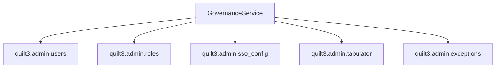
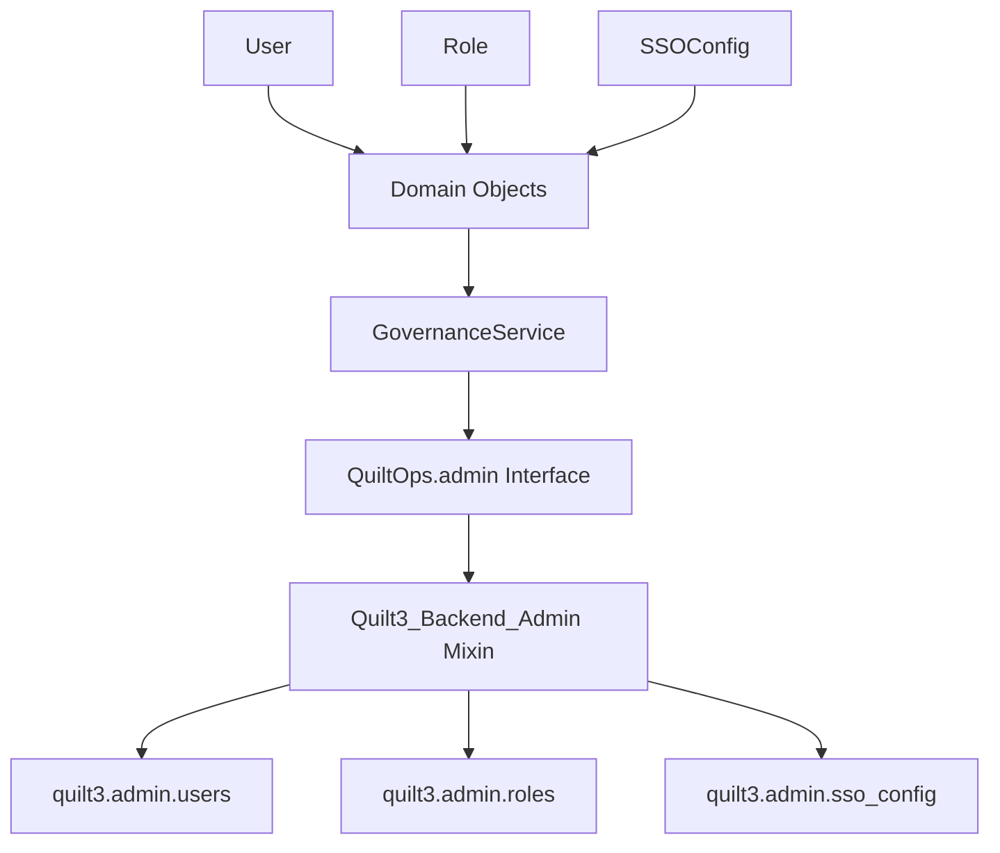
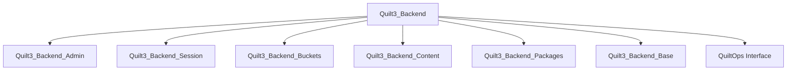

# Design Document: Quilt Ops Admin Refactoring

## Overview

This design document outlines the refactoring of the governance_service.py to use the QuiltOps abstraction pattern instead of directly calling quilt3.admin modules. The refactoring will create a clean separation between domain logic and backend implementation while maintaining full backward compatibility.

The current architecture has GovernanceService directly importing and calling quilt3.admin modules. The target architecture will follow the established pattern:

```
GovernanceService → QuiltOps.admin.* methods → Quilt3Backend.admin.* implementations → quilt3.admin modules
```

Admin operations will be organized as a submodule within QuiltOps to provide better namespace organization.

This aligns admin functionality with the existing domain-driven architecture used for packages, content, buckets, and session operations.

## Architecture

### Current Architecture



### Target Architecture



### Mixin Integration

The new admin mixin will be integrated into the existing Quilt3_Backend composition:



## Components and Interfaces

### Domain Objects

#### User Domain Object

```python
@dataclass(frozen=True)
class User:
    """Backend-agnostic user representation."""
    name: str
    email: str
    is_active: bool
    is_admin: bool
    is_sso_only: bool
    is_service: bool
    date_joined: Optional[str]  # ISO format datetime string
    last_login: Optional[str]   # ISO format datetime string
    role: Optional['Role']
    extra_roles: List['Role']
```

#### Role Domain Object

```python
@dataclass(frozen=True)
class Role:
    """Backend-agnostic role representation."""
    id: Optional[str]
    name: str
    arn: Optional[str]
    type: str
```

#### SSOConfig Domain Object

```python
@dataclass(frozen=True)
class SSOConfig:
    """Backend-agnostic SSO configuration representation."""
    text: str
    timestamp: Optional[str]  # ISO format datetime string
    uploader: Optional['User']
```

### QuiltOps Interface Extensions

The QuiltOps abstract base class will be extended with an admin submodule containing admin operation methods:

#### Admin Submodule Interface

```python
class AdminOps(ABC):
    """Abstract interface for admin operations."""
    
    @abstractmethod
    def list_users(self) -> List[User]:
        """List all users in the registry."""
        pass

    @abstractmethod
    def get_user(self, name: str) -> User:
        """Get detailed information about a specific user."""
        pass

    @abstractmethod
    def create_user(
        self, 
        name: str, 
        email: str, 
        role: str, 
        extra_roles: Optional[List[str]] = None
    ) -> User:
        """Create a new user in the registry."""
        pass

    @abstractmethod
    def delete_user(self, name: str) -> None:
        """Delete a user from the registry."""
        pass

    @abstractmethod
    def set_user_email(self, name: str, email: str) -> User:
        """Update a user's email address."""
        pass

    @abstractmethod
    def set_user_admin(self, name: str, admin: bool) -> User:
        """Set the admin status for a user."""
        pass

    @abstractmethod
    def set_user_active(self, name: str, active: bool) -> User:
        """Set the active status for a user."""
        pass

    @abstractmethod
    def reset_user_password(self, name: str) -> None:
        """Reset a user's password."""
        pass

    @abstractmethod
    def set_user_role(
        self, 
        name: str, 
        role: str, 
        extra_roles: Optional[List[str]] = None, 
        append: bool = False
    ) -> User:
        """Set the primary and extra roles for a user."""
        pass

    @abstractmethod
    def add_user_roles(self, name: str, roles: List[str]) -> User:
        """Add roles to a user."""
        pass

    @abstractmethod
    def remove_user_roles(
        self, 
        name: str, 
        roles: List[str], 
        fallback: Optional[str] = None
    ) -> User:
        """Remove roles from a user."""
        pass

    @abstractmethod
    def list_roles(self) -> List[Role]:
        """List all available roles in the registry."""
        pass

    @abstractmethod
    def get_sso_config(self) -> Optional[SSOConfig]:
        """Get the current SSO configuration."""
        pass

    @abstractmethod
    def set_sso_config(self, config: str) -> SSOConfig:
        """Set the SSO configuration."""
        pass

    @abstractmethod
    def remove_sso_config(self) -> None:
        """Remove the SSO configuration."""
        pass


class QuiltOps(ABC):
    """Domain-driven abstraction for Quilt operations."""
    
    @property
    @abstractmethod
    def admin(self) -> AdminOps:
        """Access to admin operations."""
        pass
    
    # ... existing methods ...
```

### Quilt3_Backend_Admin Mixin

The admin mixin will implement the AdminOps interface and be accessible through the QuiltOps.admin property:

```python
class Quilt3_Backend_Admin(AdminOps):
    """Mixin for admin-related operations."""
    
    def list_users(self) -> List[User]:
        """Implementation that calls quilt3.admin.users.list() and transforms to domain objects."""
        pass
    
    def _transform_quilt3_user_to_domain(self, quilt3_user) -> User:
        """Transform quilt3 user object to domain User object."""
        pass
    
    def _transform_quilt3_role_to_domain(self, quilt3_role) -> Role:
        """Transform quilt3 role object to domain Role object."""
        pass
    
    def _handle_admin_error(self, e: Exception, operation: str):
        """Handle admin operation errors with appropriate domain exceptions."""
        pass


class Quilt3_Backend(
    Quilt3_Backend_Session,
    Quilt3_Backend_Buckets,
    Quilt3_Backend_Content,
    Quilt3_Backend_Packages,
    Quilt3_Backend_Base,
    QuiltOps,
):
    """Backend implementation using quilt3 library."""
    
    def __init__(self):
        super().__init__()
        self._admin = Quilt3_Backend_Admin()
    
    @property
    def admin(self) -> AdminOps:
        """Access to admin operations."""
        return self._admin
```

### Error Handling Strategy

The admin mixin will map quilt3.admin exceptions to domain exceptions:

- `quilt3.admin.exceptions.UserNotFoundError` → `NotFoundError`
- `quilt3.admin.exceptions.BucketNotFoundError` → `NotFoundError`  
- `quilt3.admin.exceptions.Quilt3AdminError` → `BackendError`
- Generic exceptions → `BackendError`

### GovernanceService Refactoring

The GovernanceService will be refactored to use QuiltOps.admin instead of direct imports:

```python
class GovernanceService:
    def __init__(self, quilt_ops: QuiltOps, use_quilt_auth: bool = True):
        self.quilt_ops = quilt_ops
        self.use_quilt_auth = use_quilt_auth
        self.admin_available = use_quilt_auth
    
    def _transform_domain_user_to_response(self, user: User) -> Dict[str, Any]:
        """Transform domain User object to expected response format."""
        pass
    
    async def admin_users_list(self) -> Dict[str, Any]:
        """List users using QuiltOps.admin interface."""
        try:
            users = self.quilt_ops.admin.list_users()
            # Transform to response format...
        except Exception as e:
            return self._handle_domain_error(e, "list users")
```

## Data Models

### Transformation Mappings

#### quilt3.admin.users.User → Domain User

```python
def _transform_quilt3_user_to_domain(self, quilt3_user) -> User:
    return User(
        name=quilt3_user.name,
        email=quilt3_user.email,
        is_active=quilt3_user.is_active,
        is_admin=quilt3_user.is_admin,
        is_sso_only=quilt3_user.is_sso_only,
        is_service=quilt3_user.is_service,
        date_joined=quilt3_user.date_joined.isoformat() if quilt3_user.date_joined else None,
        last_login=quilt3_user.last_login.isoformat() if quilt3_user.last_login else None,
        role=self._transform_quilt3_role_to_domain(quilt3_user.role) if quilt3_user.role else None,
        extra_roles=[self._transform_quilt3_role_to_domain(r) for r in quilt3_user.extra_roles] if quilt3_user.extra_roles else []
    )
```

#### Domain User → Response Format

```python
def _transform_domain_user_to_response(self, user: User) -> Dict[str, Any]:
    return {
        "name": user.name,
        "email": user.email,
        "is_active": user.is_active,
        "is_admin": user.is_admin,
        "is_sso_only": user.is_sso_only,
        "is_service": user.is_service,
        "date_joined": user.date_joined,
        "last_login": user.last_login,
        "role": {
            "name": user.role.name,
            "id": user.role.id,
            "arn": user.role.arn,
            "type": user.role.type,
        } if user.role else None,
        "extra_roles": [
            {
                "name": role.name,
                "id": role.id,
                "arn": role.arn,
                "type": role.type,
            }
            for role in user.extra_roles
        ]
    }
```

## Correctness Properties

*A property is a characteristic or behavior that should hold true across all valid executions of a system-essentially, a formal statement about what the system should do. Properties serve as the bridge between human-readable specifications and machine-verifiable correctness guarantees.*

Now I'll analyze the acceptance criteria to determine which ones are testable as properties.

### Property Reflection

After reviewing the prework analysis, I identified several properties that can be consolidated to eliminate redundancy:

**Consolidation Opportunities:**
- Properties about domain object field presence (1.1, 1.2, 1.3, 1.4) can be combined into a single comprehensive property
- Properties about error handling consistency (3.4, 3.5, 7.1, 7.2, 7.3) can be consolidated into error handling preservation
- Properties about backward compatibility (5.2, 5.4, 5.5, 8.1, 8.2, 8.4) can be combined into API compatibility preservation
- Properties about transformation consistency (3.3, 5.3) can be combined into data transformation correctness

**Final Property Set:**
The following properties provide unique validation value without redundancy:

### Correctness Properties

**Property 1: Domain Object Structure Completeness**
*For any* admin domain object (User, Role, SSOConfig), the object should contain all required fields with proper types and no missing attributes
**Validates: Requirements 1.1, 1.2, 1.3**

**Property 2: Data Transformation Bidirectional Consistency**
*For any* quilt3.admin object, transforming it to a domain object and then to response format should preserve all original data values
**Validates: Requirements 3.3, 5.3**

**Property 3: Error Handling Preservation**
*For any* admin operation that previously raised specific exceptions (UserNotFoundError, BucketNotFoundError, Quilt3AdminError), the refactored system should produce equivalent error responses with the same message format and error codes
**Validates: Requirements 3.4, 3.5, 7.1, 7.2, 7.3**

**Property 4: Exception Mapping Consistency**
*For any* quilt3.admin exception, the admin mixin should consistently map it to the appropriate domain exception type
**Validates: Requirements 3.6**

**Property 5: Interface Implementation Completeness**
*For any* QuiltOps.admin method defined in the AdminOps interface, the Quilt3_Backend should provide a working implementation that can be called without errors
**Validates: Requirements 4.3**

**Property 6: Admin Availability Graceful Degradation**
*For any* admin operation when admin functionality is not available, the system should return appropriate error responses without crashing
**Validates: Requirements 4.4, 4.5, 7.5**

**Property 7: API Backward Compatibility**
*For any* existing governance service function, the refactored version should accept the same parameters and return responses with identical structure and data types
**Validates: Requirements 5.2, 5.4, 5.5, 8.1, 8.2**

**Property 8: Input Validation Consistency**
*For any* admin operation with input validation, the refactored system should apply the same validation rules and produce the same validation error messages
**Validates: Requirements 5.6**

**Property 9: Test Compatibility Preservation**
*For any* existing test that passes before refactoring, the same test should pass after refactoring without modification
**Validates: Requirements 6.5, 8.4**

**Property 10: Authentication Behavior Preservation**
*For any* admin operation requiring authentication, the refactored system should apply the same authentication and authorization checks
**Validates: Requirements 8.3**

**Property 11: Module Structure Backward Compatibility**
*For any* external consumer importing governance service components, the same import statements should continue to work after refactoring, with admin operations accessible via QuiltOps.admin submodule
**Validates: Requirements 8.5, 8.6**

**Property 12: Error Pattern Consistency**
*For any* error condition, the refactored system should use the same error handling and transformation patterns as other QuiltOps operations
**Validates: Requirements 9.4**

**Property 13: Domain Object Validation**
*For any* domain object creation with invalid input data, the system should raise appropriate validation errors with descriptive messages
**Validates: Requirements 10.5**

## Error Handling

### Exception Mapping Strategy

The admin mixin will implement a comprehensive exception mapping strategy:

```python
def _handle_admin_error(self, e: Exception, operation: str):
    """Map quilt3.admin exceptions to domain exceptions."""
    if isinstance(e, quilt3.admin.exceptions.UserNotFoundError):
        raise NotFoundError(f"User not found: {str(e)}", {"operation": operation, "error_type": "user_not_found"})
    elif isinstance(e, quilt3.admin.exceptions.BucketNotFoundError):
        raise NotFoundError(f"Bucket not found: {str(e)}", {"operation": operation, "error_type": "bucket_not_found"})
    elif isinstance(e, quilt3.admin.exceptions.Quilt3AdminError):
        raise BackendError(f"Admin operation failed: {str(e)}", {"operation": operation, "error_type": "admin_error"})
    else:
        raise BackendError(f"Failed to {operation}: {str(e)}", {"operation": operation, "error_type": "unknown"})
```

### Backward Compatibility Error Handling

The GovernanceService will maintain backward compatibility by catching domain exceptions and transforming them back to the expected response format:

```python
def _handle_domain_error(self, e: Exception, operation: str) -> Dict[str, Any]:
    """Transform domain exceptions to governance service response format."""
    if isinstance(e, NotFoundError):
        if "user_not_found" in e.context.get("error_type", ""):
            return format_error_response(f"User not found: {str(e)}")
        elif "bucket_not_found" in e.context.get("error_type", ""):
            return format_error_response(f"Bucket not found: {str(e)}")
    elif isinstance(e, BackendError):
        return format_error_response(f"Admin operation failed: {str(e)}")
    
    return format_error_response(f"Failed to {operation}: {str(e)}")
```

### Admin Availability Handling

The system will preserve the existing admin availability checking mechanism:

```python
def _check_admin_available(self) -> Optional[Dict[str, Any]]:
    """Check if admin functionality is available through QuiltOps."""
    if not self.admin_available:
        return format_error_response(
            "Admin functionality not available - check Quilt authentication and admin privileges"
        )
    return None
```

## Testing Strategy

### Dual Testing Approach

The refactoring will employ both unit tests and property-based tests to ensure comprehensive coverage:

**Unit Tests:**
- Test specific transformation scenarios between quilt3.admin objects and domain objects
- Test error handling for specific exception types
- Test admin availability checking with different configurations
- Test backward compatibility with existing response formats
- Integration tests between GovernanceService and QuiltOps

**Property-Based Tests:**
- Generate random admin data and verify transformation consistency
- Test error handling across all possible exception types
- Verify API compatibility with random valid inputs
- Test domain object validation with random invalid inputs
- Verify graceful degradation with random admin availability states

### Property Test Configuration

Each property test will run a minimum of 100 iterations using the appropriate property-based testing library for Python (Hypothesis). Tests will be tagged with references to their corresponding design properties:

```python
@given(user_data=user_strategy())
def test_user_transformation_round_trip(user_data):
    """Feature: quilt-ops-admin-refactoring, Property 2: Data transformation bidirectional consistency"""
    # Test implementation
```

### Test Migration Strategy

Existing governance tests will be migrated to mock QuiltOps instead of quilt3.admin modules:

**Before:**
```python
@patch('quilt3.admin.users.list')
def test_admin_users_list(mock_list):
    # Test implementation
```

**After:**
```python
@patch.object(QuiltOps, 'admin_list_users')
def test_admin_users_list(mock_list_users):
    # Test implementation
```

### Backward Compatibility Testing

A comprehensive test suite will verify that all existing functionality is preserved:

1. **Response Format Tests:** Verify that all response structures remain identical
2. **Error Message Tests:** Verify that error messages and codes are unchanged
3. **Function Signature Tests:** Verify that all function signatures are preserved
4. **Import Structure Tests:** Verify that existing imports continue to work
5. **Integration Tests:** Verify that the complete admin workflow functions correctly

The testing strategy ensures that the refactoring maintains 100% backward compatibility while providing the foundation for future enhancements through the domain-driven architecture.