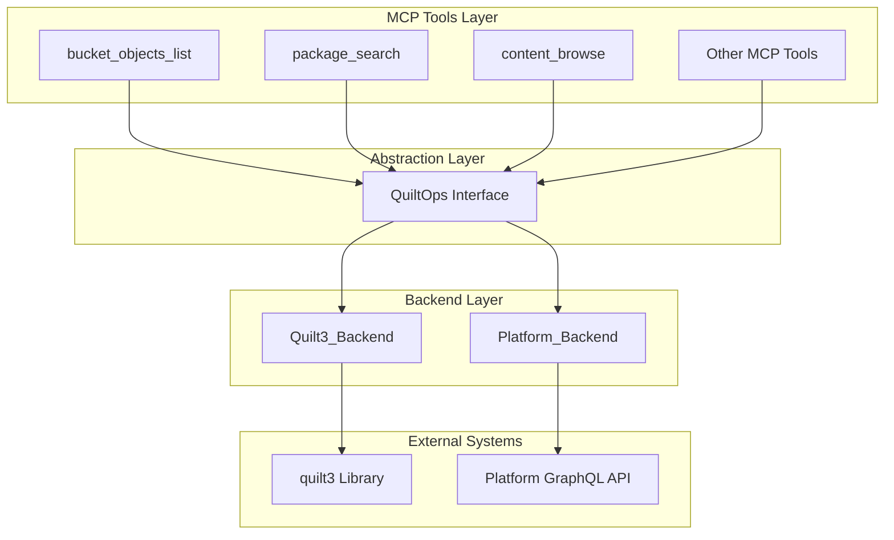
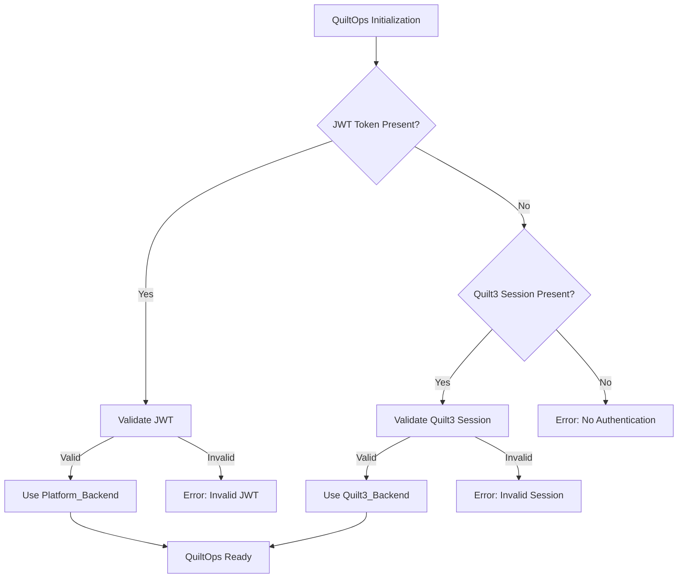

# Design Document: QuiltService Abstraction Redesign

## Implementation Scope Note

**IMPORTANT**: This design describes the full vision for the abstraction layer redesign, but the initial implementation will be **PHASE 1 ONLY**:

- **Phase 1 (This Sprint)**: Migrate existing tools to work properly with the new QuiltOps abstraction using **ONLY the Quilt3_Backend**
- **Phase 2 (Future Sprint)**: Add Platform_Backend support for HTTP/JWT authentication mode

The goal of Phase 1 is to establish the proper abstraction layer architecture and migrate all existing MCP tools to use domain-driven operations instead of quilt3-specific types. This creates the foundation for Phase 2 to add Platform_Backend support without changing the interface again.

During Phase 1 implementation:

- Implement QuiltOps interface and Quilt3_Backend only
- Authentication logic should only handle quilt3 sessions (no JWT routing yet)
- Focus on transforming existing tools to use Package_Info, Content_Info, and Bucket_Info objects
- Ensure all domain transformations work correctly with quilt3 backend

## Overview

This design transforms the QuiltService from a quilt3-specific wrapper into a true domain-driven abstraction layer called QuiltOps. The new architecture supports multiple backends (quilt3 library and Platform GraphQL) while providing a unified interface for MCP tools.

The core architectural shift moves from "quilt3-shaped" operations to domain-driven operations that abstract away backend implementation details. This enables seamless support for both stdio authentication (quilt3 sessions) and HTTP authentication (JWT tokens) without changing the interface consumed by MCP tools.

## Architecture

### High-Level Architecture



### Authentication Flow



## Components and Interfaces

### QuiltOps Interface

The main abstraction layer that provides domain-driven operations:

```python
from abc import ABC, abstractmethod
from typing import List, Optional, Dict, Any
from dataclasses import dataclass

@dataclass
class Package_Info:
    """Backend-agnostic package information"""
    name: str
    description: Optional[str]
    tags: List[str]
    modified_date: str
    registry: str
    bucket: str
    top_hash: str
    
@dataclass
class Content_Info:
    """Backend-agnostic content information"""
    path: str
    size: Optional[int]
    type: str  # 'file' or 'directory'
    modified_date: Optional[str]
    download_url: Optional[str]
    
@dataclass
class Bucket_Info:
    """Backend-agnostic bucket information"""
    name: str
    region: str
    access_level: str
    created_date: Optional[str]

class QuiltOps(ABC):
    """Domain-driven abstraction for Quilt operations"""
    
    @abstractmethod
    def search_packages(self, query: str, registry: str) -> List[Package_Info]:
        """Search for packages matching query"""
        pass
    
    @abstractmethod
    def get_package_info(self, package_name: str, registry: str) -> Package_Info:
        """Get detailed information about a specific package"""
        pass
    
    @abstractmethod
    def browse_content(self, package_name: str, registry: str, path: str = "") -> List[Content_Info]:
        """Browse contents of a package at the specified path"""
        pass
    
    @abstractmethod
    def list_buckets(self) -> List[Bucket_Info]:
        """List accessible buckets"""
        pass
    
    @abstractmethod
    def get_content_url(self, package_name: str, registry: str, path: str) -> str:
        """Get download URL for specific content"""
        pass
```

### Backend Implementations

#### Quilt3_Backend

Implements QuiltOps using the quilt3 Python library:

```python
class Quilt3_Backend(QuiltOps):
    """Backend implementation using quilt3 library"""
    
    def __init__(self, session_config: Dict[str, Any]):
        self.session = self._validate_session(session_config)
    
    def search_packages(self, query: str, registry: str) -> List[Package_Info]:
        # Use quilt3.search() and transform results to Package_Info
        packages = quilt3.search(query, registry=registry)
        return [self._transform_package(pkg) for pkg in packages]
    
    def _transform_package(self, quilt3_package) -> Package_Info:
        """Transform quilt3 Package to domain Package_Info"""
        return Package_Info(
            name=quilt3_package.name,
            description=quilt3_package.description,
            tags=quilt3_package.tags or [],
            modified_date=quilt3_package.modified.isoformat(),
            registry=quilt3_package.registry,
            bucket=quilt3_package.bucket,
            top_hash=quilt3_package.top_hash
        )
```

#### Platform_Backend

Implements QuiltOps using Platform GraphQL API:

```python
class Platform_Backend(QuiltOps):
    """Backend implementation using Platform GraphQL API"""
    
    def __init__(self, jwt_token: str, api_endpoint: str):
        self.token = self._validate_jwt(jwt_token)
        self.client = GraphQLClient(api_endpoint, headers={"Authorization": f"Bearer {jwt_token}"})
    
    def search_packages(self, query: str, registry: str) -> List[Package_Info]:
        # Use GraphQL query and transform results to Package_Info
        gql_query = """
        query SearchPackages($query: String!, $registry: String!) {
            packages(search: $query, registry: $registry) {
                name
                description
                tags
                modifiedAt
                registry
                bucket
                topHash
            }
        }
        """
        result = self.client.execute(gql_query, {"query": query, "registry": registry})
        return [self._transform_package(pkg) for pkg in result["packages"]]
    
    def _transform_package(self, gql_package) -> Package_Info:
        """Transform GraphQL package to domain Package_Info"""
        return Package_Info(
            name=gql_package["name"],
            description=gql_package.get("description"),
            tags=gql_package.get("tags", []),
            modified_date=gql_package["modifiedAt"],
            registry=gql_package["registry"],
            bucket=gql_package["bucket"],
            top_hash=gql_package["topHash"]
        )
```

### Factory and Routing

The QuiltOpsFactory handles authentication detection and backend selection:

```python
class QuiltOpsFactory:
    """Factory for creating appropriate QuiltOps backend"""
    
    @staticmethod
    def create() -> QuiltOps:
        """Create QuiltOps instance with appropriate backend"""
        
        # Priority 1: JWT authentication
        jwt_token = os.getenv("QUILT_JWT_TOKEN")
        if jwt_token:
            try:
                return Platform_Backend(jwt_token, PLATFORM_API_ENDPOINT)
            except InvalidJWTError as e:
                raise AuthenticationError(f"JWT authentication failed: {e}")
        
        # Priority 2: Quilt3 session
        try:
            session_config = quilt3.session.get_session_info()
            if session_config:
                return Quilt3_Backend()
        except Exception as e:
            pass  # Fall through to error
        
        # Priority 3: Error
        raise AuthenticationError(
            "No valid authentication found. Please provide either:\n"
            "1. JWT token via QUILT_JWT_TOKEN environment variable, or\n"
            "2. Valid quilt3 session via 'quilt3 login'"
        )
```

## Data Models

### Domain Objects

The design uses three primary domain objects that abstract away backend-specific representations:

1. **Package_Info**: Represents package metadata consistently across backends
2. **Content_Info**: Represents file/directory information consistently across backends  
3. **Bucket_Info**: Represents bucket metadata consistently across backends

These objects ensure that MCP tools work with Quilt concepts rather than backend-specific types like quilt3.Package instances or GraphQL response objects.

### Transformation Layer

Each backend implements transformation methods that convert backend-specific responses into domain objects:

- `Quilt3_Backend._transform_package()`: quilt3.Package → Package_Info
- `Platform_Backend._transform_package()`: GraphQL response → Package_Info
- Similar transformations for Content_Info and Bucket_Info

This transformation layer is critical for maintaining interface consistency while allowing each backend to optimize its internal operations.

## Correctness Properties

*A property is a characteristic or behavior that should hold true across all valid executions of a system-essentially, a formal statement about what the system should do. Properties serve as the bridge between human-readable specifications and machine-verifiable correctness guarantees.*

### Property 1: Domain Object Consistency

*For any* QuiltOps operation (search_packages, browse_content, list_buckets), the returned objects should always be domain objects (Package_Info, Content_Info, Bucket_Info) regardless of which backend is used
**Validates: Requirements 1.1, 1.2, 1.3**

### Property 2: Backend Equivalence

*For any* supported operation and equivalent inputs, both Quilt3_Backend and Platform_Backend should return functionally equivalent domain objects with the same essential metadata fields
**Validates: Requirements 2.4, 4.1, 4.2, 4.3, 4.4, 4.5**

### Property 3: Authentication-Based Routing

*For any* authentication configuration (JWT present, quilt3 session present, or both), the QuiltOpsFactory should route operations to the correct backend according to the priority order: JWT first, then quilt3 session
**Validates: Requirements 2.1, 2.2, 2.3, 3.1, 3.2, 3.5**

### Property 4: Authentication Validation

*For any* invalid authentication credentials (malformed JWT, corrupted session), the system should reject the credentials and provide specific error messages indicating which authentication method failed
**Validates: Requirements 3.1, 3.2, 3.4**

### Property 5: Error Message Completeness

*For any* system error (backend failure, authentication failure, network failure), the error message should include the backend type, failure category, and specific failure reason
**Validates: Requirements 2.5, 5.1, 5.2, 5.3**

### Property 6: Debug Logging Traceability

*For any* operation execution, debug logs should contain sufficient information to trace routing decisions, backend selection logic, and operation outcomes
**Validates: Requirements 5.4, 5.5**

## Error Handling

### Authentication Errors

The system implements a strict authentication priority with clear error messaging:

1. **JWT Validation Errors**: When JWT tokens are present but invalid, the system immediately fails with specific JWT error details
2. **Session Validation Errors**: When JWT is absent but quilt3 sessions are invalid, the system fails with session-specific error details  
3. **No Authentication Errors**: When neither authentication method is available, the system provides clear instructions for both authentication options

### Backend Operation Errors

Each backend implements consistent error handling patterns:

- **Network Errors**: Distinguish between connectivity issues and API-level errors
- **Authorization Errors**: Provide specific information about permission failures
- **Data Errors**: Handle malformed responses and missing data gracefully
- **Timeout Errors**: Implement appropriate timeouts with clear error messages

### Error Propagation

The abstraction layer ensures that:

- Backend-specific errors are transformed into domain-appropriate error messages
- Error context includes the backend type for debugging
- Comparative logging helps identify backend-specific issues
- Error messages provide actionable remediation steps

## Testing Strategy

### Dual Testing Approach

The testing strategy employs both unit tests and integration tests to ensure comprehensive coverage:

**Unit Tests** focus on:

- Specific authentication scenarios (valid JWT, invalid session, etc.)
- Error handling edge cases (network failures, malformed responses)
- Backend-specific transformation logic
- Factory routing logic with known authentication states

**Integration Tests** focus on:

- End-to-end workflows through each backend
- Authentication routing consistency
- Error message completeness across different failure scenarios
- Domain object consistency across all operations

### Backend Equivalence Testing

A focused approach to validating that both backends work correctly:

1. **Basic Functionality**: Ensure each backend can perform core operations independently
2. **Simple Equivalence**: Basic tests that both backends return the expected domain objects
3. **Error Handling**: Ensure both backends handle common error conditions appropriately
4. **Start Simple**: Focus on getting basic functionality working before comprehensive equivalence testing

### Integration Testing

Integration tests validate complete workflows:

- End-to-end package search and content browsing
- Authentication flow testing with real credentials (in test environments)
- Backend switching scenarios
- Error recovery and fallback mechanisms

The testing framework ensures that the abstraction layer provides backend-agnostic operations while maintaining the flexibility to optimize each backend independently.
