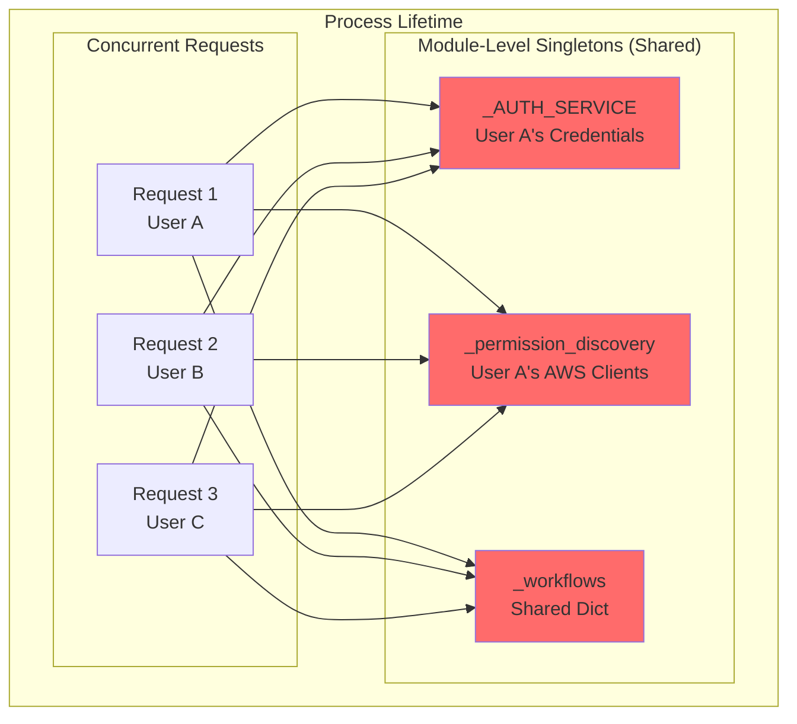
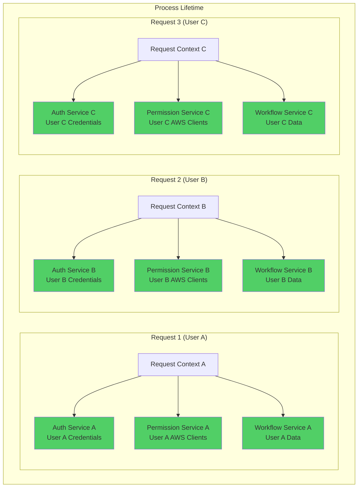
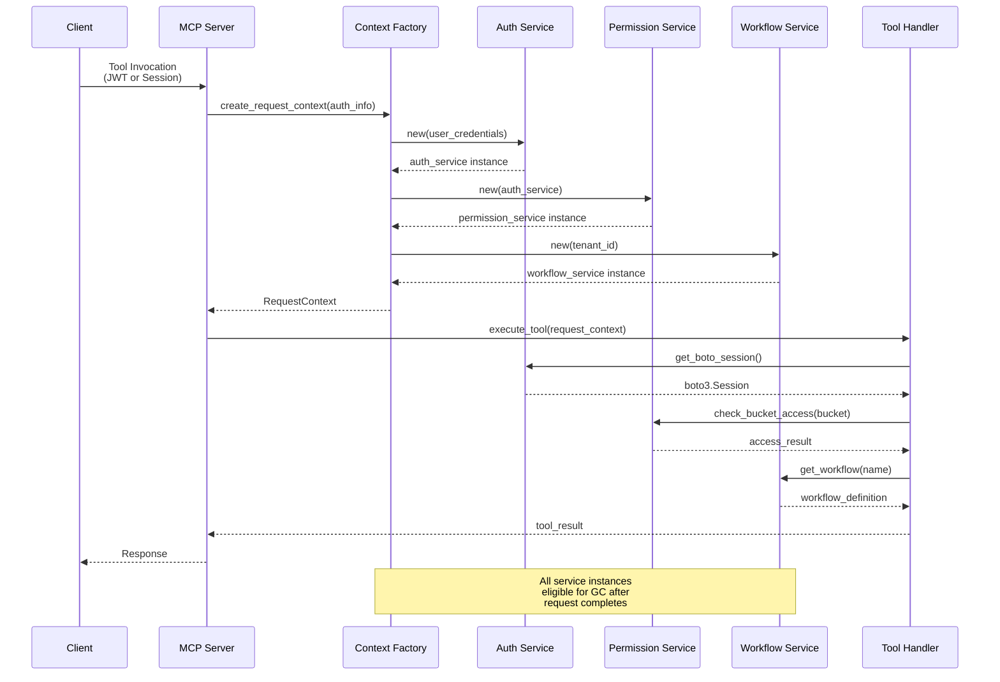
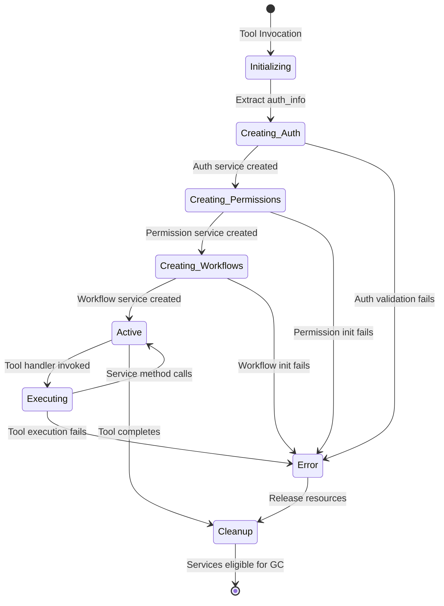

# Design Document: Request-Scoped Service Management

## Implementation Scope Note

**IMPORTANT**: This design describes the elimination of module-level singletons and
introduction of request-scoped service management to enable safe multitenant deployments.

This implementation proceeds **incrementally** across four phases:

- **Phase 1**: Eliminate authentication service singleton (`_AUTH_SERVICE`)
- **Phase 2**: Eliminate permission discovery singleton (`_permission_discovery`)
- **Phase 3**: Eliminate workflow service singleton (`_workflows`)
- **Phase 4**: Add multitenant deployment support

Each phase can be implemented, tested, and deployed independently. The system supports both
single-user and multitenant modes using the same request-scoped architecture.

## Overview

This design transforms the MCP server from using module-level singleton services to
request-scoped service instances. The core architectural shift moves from "shared global
state" to "isolated per-request state" to eliminate critical security vulnerabilities in
multitenant deployments.

The current architecture assumes a single-user-per-process model where services are
initialized once and reused across all requests. This creates shared mutable state that
leads to:

- **Credential Leakage**: User A's AWS credentials cached in `_AUTH_SERVICE` are reused for User B's requests
- **Permission Escalation**: User A's permission cache is shared with User B
- **Data Isolation Violations**: User A can access User B's workflows

The new architecture ensures each request has completely isolated service instances with proper tenant boundaries.

## Architecture

### High-Level Architecture Comparison

#### Current Architecture (Module-Level Singletons)



**Problems:**
- ❌ All requests share same service instances
- ❌ User A's credentials used for User B's operations
- ❌ Permission caches mixed across users
- ❌ Workflow data shared without tenant isolation

#### New Architecture (Request-Scoped Services)



**Benefits:**
- ✅ Each request has isolated service instances
- ✅ Credentials never leak across request boundaries
- ✅ Permission caches isolated per user
- ✅ Workflow data properly partitioned by tenant

### Request Lifecycle Flow



## Components and Interfaces

### Request Context

The central abstraction that holds all request-scoped services:

```python
from dataclasses import dataclass
from typing import Optional
import uuid

@dataclass
class RequestContext:
    """Container for all request-scoped services and state"""

    request_id: str
    tenant_id: str
    user_id: Optional[str]
    auth_service: 'AuthService'
    permission_service: 'PermissionDiscoveryService'
    workflow_service: 'WorkflowService'

    def __post_init__(self):
        """Validate that all required services are present"""
        if not self.auth_service:
            raise ValueError("auth_service is required")
        if not self.permission_service:
            raise ValueError("permission_service is required")
        if not self.workflow_service:
            raise ValueError("workflow_service is required")

    @property
    def is_authenticated(self) -> bool:
        """Check if request has valid authentication"""
        return self.auth_service.is_valid()

    def get_boto_session(self) -> 'boto3.Session':
        """Get boto3 session for this request's credentials"""
        return self.auth_service.get_session()
```

### Request Context Factory

Creates and initializes request contexts with proper service instances:

```python
from typing import Optional, Dict, Any
import os

class RequestContextFactory:
    """Factory for creating request-scoped service instances"""

    def __init__(self, mode: str = "auto"):
        """
        Initialize factory with deployment mode.

        Args:
            mode: "single-user", "multitenant", or "auto" (detect from env)
        """
        self.mode = self._determine_mode(mode)

    def _determine_mode(self, mode: str) -> str:
        """Determine deployment mode from config or environment"""
        if mode != "auto":
            return mode

        # Auto-detect based on environment
        if os.getenv("QUILT_MULTITENANT_MODE") == "true":
            return "multitenant"
        return "single-user"

    def create_context(
        self,
        auth_info: Dict[str, Any],
        tenant_id: Optional[str] = None,
        user_id: Optional[str] = None
    ) -> RequestContext:
        """
        Create new request context with isolated service instances.

        Args:
            auth_info: Authentication information (JWT token or session config)
            tenant_id: Tenant identifier (required for multitenant mode)
            user_id: User identifier (optional)

        Returns:
            RequestContext with fresh service instances

        Raises:
            AuthenticationError: If authentication validation fails
            ValueError: If tenant_id missing in multitenant mode
        """
        request_id = str(uuid.uuid4())

        # Validate tenant requirements
        if self.mode == "multitenant" and not tenant_id:
            raise ValueError("tenant_id is required in multitenant mode")

        # Use default tenant for single-user mode
        effective_tenant_id = tenant_id or "default"

        # Create auth service instance
        auth_service = self._create_auth_service(auth_info)

        # Create permission service instance (depends on auth)
        permission_service = self._create_permission_service(auth_service)

        # Create workflow service instance (isolated per tenant)
        workflow_service = self._create_workflow_service(effective_tenant_id)

        return RequestContext(
            request_id=request_id,
            tenant_id=effective_tenant_id,
            user_id=user_id,
            auth_service=auth_service,
            permission_service=permission_service,
            workflow_service=workflow_service
        )

    def _create_auth_service(self, auth_info: Dict[str, Any]) -> 'AuthService':
        """Create fresh auth service instance with provided credentials"""
        # Check for JWT token first
        if "jwt_token" in auth_info:
            return JWTAuthService(auth_info["jwt_token"])

        # Fall back to IAM session
        if "session_config" in auth_info:
            return IAMAuthService(auth_info["session_config"])

        raise AuthenticationError("No valid authentication provided")

    def _create_permission_service(
        self,
        auth_service: 'AuthService'
    ) -> 'PermissionDiscoveryService':
        """Create fresh permission service instance"""
        # Each instance gets its own AWS clients and cache
        return PermissionDiscoveryService(auth_service)

    def _create_workflow_service(
        self,
        tenant_id: str
    ) -> 'WorkflowService':
        """Create workflow service instance isolated to tenant"""
        # Workflow service accesses tenant-partitioned storage
        return WorkflowService(tenant_id)
```

### Updated Service Interfaces

#### Auth Service (No Longer Singleton)

```python
from abc import ABC, abstractmethod
import boto3

class AuthService(ABC):
    """Base class for authentication services (request-scoped)"""

    @abstractmethod
    def get_session(self) -> boto3.Session:
        """Get boto3 session with appropriate credentials"""
        pass

    @abstractmethod
    def is_valid(self) -> bool:
        """Check if credentials are still valid"""
        pass

    @abstractmethod
    def get_user_identity(self) -> Dict[str, str]:
        """Get user identity information for logging/audit"""
        pass

class JWTAuthService(AuthService):
    """Auth service using JWT token for AWS credentials"""

    def __init__(self, jwt_token: str):
        self.jwt_token = jwt_token
        self._session = None
        self._validate_and_initialize()

    def _validate_and_initialize(self):
        """Validate JWT and initialize boto3 session"""
        # Decode JWT, validate, exchange for AWS credentials
        credentials = self._exchange_jwt_for_credentials(self.jwt_token)
        self._session = boto3.Session(
            aws_access_key_id=credentials["access_key"],
            aws_secret_access_key=credentials["secret_key"],
            aws_session_token=credentials.get("session_token")
        )

    def get_session(self) -> boto3.Session:
        return self._session

    def is_valid(self) -> bool:
        # Check JWT expiration
        return self._check_jwt_validity(self.jwt_token)

class IAMAuthService(AuthService):
    """Auth service using IAM session from quilt3.login()"""

    def __init__(self, session_config: Dict[str, Any]):
        self.session_config = session_config
        self._session = None
        self._validate_and_initialize()

    def _validate_and_initialize(self):
        """Validate session config and initialize boto3 session"""
        # Validate quilt3 session is still valid
        if not self._validate_session(self.session_config):
            raise AuthenticationError("Invalid quilt3 session")

        self._session = boto3.Session(**self.session_config)

    def get_session(self) -> boto3.Session:
        return self._session
```

#### Permission Discovery Service (No Longer Singleton)

```python
from typing import Dict, Set, Optional
from datetime import datetime, timedelta
import boto3

class PermissionDiscoveryService:
    """Request-scoped permission checking and caching"""

    def __init__(self, auth_service: AuthService):
        """
        Initialize with request-specific auth service.

        Args:
            auth_service: Auth service for this request (provides credentials)
        """
        self.auth_service = auth_service
        self._cache: Dict[str, Any] = {}
        self._cache_ttl = timedelta(minutes=15)

        # Initialize AWS clients with this request's credentials
        session = auth_service.get_session()
        self.s3_client = session.client('s3')
        self.iam_client = session.client('iam')
        self.sts_client = session.client('sts')

    def check_bucket_access(
        self,
        bucket_name: str,
        required_permissions: Set[str]
    ) -> Dict[str, bool]:
        """
        Check access to bucket with this request's credentials.

        Cache is request-scoped, so results are isolated to this user.
        """
        cache_key = f"bucket:{bucket_name}:{sorted(required_permissions)}"

        # Check request-scoped cache
        if cache_key in self._cache:
            cached = self._cache[cache_key]
            if datetime.now() < cached["expires"]:
                return cached["result"]

        # Perform permission check with this request's AWS clients
        result = self._perform_permission_check(
            bucket_name,
            required_permissions
        )

        # Cache in request-scoped cache
        self._cache[cache_key] = {
            "result": result,
            "expires": datetime.now() + self._cache_ttl
        }

        return result
```

#### Workflow Service (No Longer Singleton)

```python
from typing import Dict, List, Optional
from pathlib import Path
import json

class WorkflowService:
    """Request-scoped workflow management with tenant isolation"""

    def __init__(self, tenant_id: str):
        """
        Initialize with tenant ID for data isolation.

        Args:
            tenant_id: Tenant identifier for isolating workflow data
        """
        self.tenant_id = tenant_id
        self._storage = self._initialize_storage(tenant_id)

    def _initialize_storage(self, tenant_id: str) -> 'WorkflowStorage':
        """
        Initialize tenant-isolated workflow storage.

        Storage options:
        - File-based: ~/.quilt/workflows/{tenant_id}/
        - Database: workflows table with tenant_id column
        - S3: s3://workflow-bucket/{tenant_id}/
        """
        # For now, use file-based storage with tenant partitioning
        storage_path = Path.home() / ".quilt" / "workflows" / tenant_id
        storage_path.mkdir(parents=True, exist_ok=True)
        return FileBasedWorkflowStorage(storage_path)

    def create_workflow(
        self,
        name: str,
        definition: Dict[str, Any]
    ) -> None:
        """
        Create workflow for this tenant only.

        Workflow is isolated to self.tenant_id.
        """
        self._storage.save(name, definition)

    def get_workflow(self, name: str) -> Optional[Dict[str, Any]]:
        """Get workflow for this tenant only"""
        return self._storage.load(name)

    def list_workflows(self) -> List[str]:
        """List workflows for this tenant only"""
        return self._storage.list_all()

    def delete_workflow(self, name: str) -> bool:
        """Delete workflow for this tenant only"""
        return self._storage.delete(name)

class FileBasedWorkflowStorage:
    """File-based workflow storage with tenant isolation"""

    def __init__(self, storage_path: Path):
        self.storage_path = storage_path

    def save(self, name: str, definition: Dict[str, Any]) -> None:
        """Save workflow to tenant-isolated directory"""
        workflow_file = self.storage_path / f"{name}.json"
        with workflow_file.open("w") as f:
            json.dump(definition, f, indent=2)

    def load(self, name: str) -> Optional[Dict[str, Any]]:
        """Load workflow from tenant-isolated directory"""
        workflow_file = self.storage_path / f"{name}.json"
        if not workflow_file.exists():
            return None
        with workflow_file.open("r") as f:
            return json.load(f)

    def list_all(self) -> List[str]:
        """List all workflows in tenant-isolated directory"""
        return [
            f.stem for f in self.storage_path.glob("*.json")
        ]

    def delete(self, name: str) -> bool:
        """Delete workflow from tenant-isolated directory"""
        workflow_file = self.storage_path / f"{name}.json"
        if workflow_file.exists():
            workflow_file.unlink()
            return True
        return False
```

### MCP Tool Integration

MCP tools access services through the request context:

```python
from typing import Any, Dict
from mcp.server import Server
from mcp.types import Tool, TextContent

# Context variable for thread-local request context
_request_context: Optional[RequestContext] = None

def get_current_context() -> RequestContext:
    """Get the request context for the current request"""
    if _request_context is None:
        raise RuntimeError(
            "No request context available. "
            "This function must be called within a request scope."
        )
    return _request_context

def set_current_context(context: RequestContext) -> None:
    """Set the request context for the current request"""
    global _request_context
    _request_context = context

# MCP Server with request context middleware
server = Server("quilt-mcp")

@server.call_tool()
async def handle_call_tool(name: str, arguments: Dict[str, Any]) -> list[TextContent]:
    """Handle tool invocation with request-scoped services"""

    # Extract authentication info from request
    auth_info = extract_auth_from_request()
    tenant_id = extract_tenant_from_request()

    # Create request context
    context_factory = RequestContextFactory()
    context = context_factory.create_context(
        auth_info=auth_info,
        tenant_id=tenant_id
    )

    # Set context for this request
    set_current_context(context)

    try:
        # Execute tool with isolated services
        if name == "bucket_objects_list":
            return await bucket_objects_list_impl(arguments)
        elif name == "workflow_create":
            return await workflow_create_impl(arguments)
        # ... other tools
    finally:
        # Clear context after request completes
        set_current_context(None)

async def bucket_objects_list_impl(arguments: Dict[str, Any]) -> list[TextContent]:
    """Implementation that uses request-scoped services"""

    # Get services from request context
    context = get_current_context()

    # Use request-scoped auth service
    session = context.get_boto_session()
    s3_client = session.client('s3')

    # Use request-scoped permission service
    has_access = context.permission_service.check_bucket_access(
        arguments["bucket"],
        {"s3:ListBucket"}
    )

    if not has_access["s3:ListBucket"]:
        return [TextContent(
            type="text",
            text=f"Access denied to bucket {arguments['bucket']}"
        )]

    # Perform operation with this user's credentials
    response = s3_client.list_objects_v2(
        Bucket=arguments["bucket"],
        Prefix=arguments.get("prefix", "")
    )

    return [TextContent(
        type="text",
        text=json.dumps(response["Contents"], indent=2)
    )]
```

## Data Models

### Request Context Lifecycle



### Service Isolation Guarantees

```python
# Guarantee 1: Each request has isolated auth credentials
assert request_a.auth_service is not request_b.auth_service
assert request_a.auth_service.get_session() != request_b.auth_service.get_session()

# Guarantee 2: Permission caches are not shared
request_a.permission_service.check_bucket_access("bucket", {"s3:ListBucket"})
request_b.permission_service.check_bucket_access("bucket", {"s3:ListBucket"})
assert request_a.permission_service._cache is not request_b.permission_service._cache

# Guarantee 3: Workflow data is tenant-isolated
request_a.workflow_service.create_workflow("analysis", {...})  # tenant_a
request_b.workflow_service.create_workflow("analysis", {...})  # tenant_b
assert request_a.workflow_service.get_workflow("analysis") != \
       request_b.workflow_service.get_workflow("analysis")

# Guarantee 4: Service instances destroyed after request
context = factory.create_context(auth_info)
context_id = id(context)
del context  # Request completes
# All service instances (auth, permission, workflow) are eligible for GC
```

## Correctness Properties

### Property 1: Service Instance Isolation

*For any* two concurrent requests R1 and R2, the service instances shall be completely
isolated:

- `R1.context.auth_service is not R2.context.auth_service`
- `R1.context.permission_service is not R2.context.permission_service`
- `R1.context.workflow_service is not R2.context.workflow_service`

**Validates: Requirements 1.1, 1.2, 1.3, 8.1**

### Property 2: Credential Non-Leakage

*For any* request R with credentials C, no other request shall be able to access
credentials C:

- User A's boto3 session shall never be returned to User B's request
- Auth service instances shall not be cached or reused across requests
- Credentials shall be destroyed when request context is destroyed

**Validates: Requirements 1.4, 3.1, 3.2, 3.3, 3.4, 3.5**

### Property 3: Permission Cache Isolation

*For any* permission check result cached in request R1's permission service, the result
shall not be accessible to request R2:

- Permission caches are stored in request-scoped service instances
- Cache TTL applies only within the request's permission service instance
- Cache invalidation in R1 does not affect R2

**Validates: Requirements 4.1, 4.2, 4.3, 4.4**

### Property 4: Workflow Tenant Isolation

*For any* workflow operation in request R with tenant_id T, the operation shall only access
workflows for tenant T:

- `workflow_service.list_workflows()` returns only tenant T's workflows
- `workflow_service.create_workflow(name)` creates workflow for tenant T only
- `workflow_service.get_workflow(name)` returns workflow for tenant T only
- Tenant A cannot access, modify, or delete Tenant B's workflows

**Validates: Requirements 5.1, 5.2, 5.3, 5.4, 5.5**

### Property 5: Service Lifecycle Correctness

*For any* request R, the service instances shall follow the correct lifecycle:

- Services created at request start
- Services accessible only during request execution
- Services destroyed after request completes
- No references retained after request context is cleared

**Validates: Requirements 1.5, 2.1, 2.2, 2.5, 8.3**

### Property 6: Context Propagation Correctness

*For any* MCP tool invocation, the request context shall be:

- Available to all code executed within the tool handler
- Accessible via `get_current_context()` without manual threading
- Automatically cleared after tool completion
- Providing clear error if accessed outside request scope

**Validates: Requirements 7.1, 7.2, 7.3, 7.4, 7.5**

### Property 7: Mode-Specific Behavior

*For any* deployment mode (single-user vs multitenant):

- **Single-user mode**: Works without tenant_id, uses "default" tenant
- **Multitenant mode**: Requires tenant_id, enforces tenant validation
- Mode detection works correctly based on environment configuration
- Single-user mode works correctly with simplified configuration

**Validates: Requirements 6.1, 6.2, 6.3, 6.4**

### Property 8: Concurrent Request Safety

*For any* N concurrent requests R1...RN:

- Each request has completely isolated service instances
- No shared mutable state between requests
- No race conditions in service instance creation
- No deadlocks or resource contention
- No credential leakage under concurrent load

**Validates: Requirements 8.1, 8.2, 8.3, 8.4, 8.5**

## Error Handling

### Authentication Errors

```python
class AuthenticationError(Exception):
    """Raised when authentication validation fails"""

    def __init__(self, message: str, auth_type: Optional[str] = None):
        self.auth_type = auth_type  # "jwt" or "iam"
        super().__init__(message)

# Usage in factory
try:
    auth_service = factory._create_auth_service(auth_info)
except JWTValidationError as e:
    raise AuthenticationError(
        f"JWT authentication failed: {e}",
        auth_type="jwt"
    )
except IAMSessionError as e:
    raise AuthenticationError(
        f"IAM session validation failed: {e}",
        auth_type="iam"
    )
```

### Context Access Errors

```python
class ContextNotAvailableError(RuntimeError):
    """Raised when request context accessed outside request scope"""

    def __init__(self):
        super().__init__(
            "No request context available. "
            "Request-scoped services can only be accessed during "
            "tool execution. Ensure you're calling this from within "
            "a tool handler, not at module level."
        )

# Usage in get_current_context
def get_current_context() -> RequestContext:
    if _request_context is None:
        raise ContextNotAvailableError()
    return _request_context
```

### Service Initialization Errors

```python
class ServiceInitializationError(Exception):
    """Raised when service fails to initialize"""

    def __init__(self, service_name: str, reason: str):
        self.service_name = service_name
        super().__init__(
            f"Failed to initialize {service_name}: {reason}"
        )

# Usage in factory
try:
    permission_service = PermissionDiscoveryService(auth_service)
except Exception as e:
    raise ServiceInitializationError(
        "PermissionDiscoveryService",
        f"AWS client initialization failed: {e}"
    )
```

### Tenant Validation Errors

```python
class TenantValidationError(ValueError):
    """Raised when tenant validation fails"""

    def __init__(self, mode: str, tenant_id: Optional[str]):
        if mode == "multitenant" and not tenant_id:
            message = (
                "tenant_id is required in multitenant mode. "
                "Ensure authentication includes tenant identifier."
            )
        else:
            message = f"Invalid tenant_id: {tenant_id}"

        super().__init__(message)

# Usage in factory
if self.mode == "multitenant" and not tenant_id:
    raise TenantValidationError(self.mode, tenant_id)
```

## Testing Strategy

### Unit Tests

#### Test 1: Service Instance Isolation

```python
def test_service_instance_isolation():
    """Verify each request gets isolated service instances"""
    factory = RequestContextFactory()

    auth_info_a = {"jwt_token": "user_a_token"}
    auth_info_b = {"jwt_token": "user_b_token"}

    context_a = factory.create_context(auth_info_a, tenant_id="tenant_a")
    context_b = factory.create_context(auth_info_b, tenant_id="tenant_b")

    # Auth services are different instances
    assert context_a.auth_service is not context_b.auth_service

    # Permission services are different instances
    assert context_a.permission_service is not context_b.permission_service

    # Workflow services are different instances
    assert context_a.workflow_service is not context_b.workflow_service
```

#### Test 2: Credential Non-Leakage

```python
def test_credential_non_leakage():
    """Verify User A's credentials not accessible to User B"""
    factory = RequestContextFactory()

    # User A with IAM credentials
    auth_info_a = {
        "session_config": {
            "aws_access_key_id": "AKIA_USER_A",
            "aws_secret_access_key": "secret_a"
        }
    }
    context_a = factory.create_context(auth_info_a, tenant_id="tenant_a")
    session_a = context_a.get_boto_session()

    # User B with different IAM credentials
    auth_info_b = {
        "session_config": {
            "aws_access_key_id": "AKIA_USER_B",
            "aws_secret_access_key": "secret_b"
        }
    }
    context_b = factory.create_context(auth_info_b, tenant_id="tenant_b")
    session_b = context_b.get_boto_session()

    # Sessions use different credentials
    assert session_a.get_credentials().access_key != \
           session_b.get_credentials().access_key
```

#### Test 3: Permission Cache Isolation

```python
def test_permission_cache_isolation():
    """Verify permission caches not shared between requests"""
    factory = RequestContextFactory()

    context_a = factory.create_context(
        {"jwt_token": "user_a_token"},
        tenant_id="tenant_a"
    )
    context_b = factory.create_context(
        {"jwt_token": "user_b_token"},
        tenant_id="tenant_b"
    )

    # User A checks bucket permissions (populates cache)
    result_a = context_a.permission_service.check_bucket_access(
        "test-bucket",
        {"s3:ListBucket"}
    )

    # User B checks same bucket (should not hit User A's cache)
    result_b = context_b.permission_service.check_bucket_access(
        "test-bucket",
        {"s3:ListBucket"}
    )

    # Caches are isolated
    assert context_a.permission_service._cache is not \
           context_b.permission_service._cache
```

#### Test 4: Workflow Tenant Isolation

```python
def test_workflow_tenant_isolation():
    """Verify workflow data isolated per tenant"""
    factory = RequestContextFactory()

    context_a = factory.create_context(
        {"jwt_token": "user_a_token"},
        tenant_id="tenant_a"
    )
    context_b = factory.create_context(
        {"jwt_token": "user_b_token"},
        tenant_id="tenant_b"
    )

    # Both users create workflow with same name
    context_a.workflow_service.create_workflow(
        "analysis",
        {"steps": ["step1_a", "step2_a"]}
    )
    context_b.workflow_service.create_workflow(
        "analysis",
        {"steps": ["step1_b", "step2_b"]}
    )

    # Each user sees only their own workflow
    workflow_a = context_a.workflow_service.get_workflow("analysis")
    workflow_b = context_b.workflow_service.get_workflow("analysis")

    assert workflow_a["steps"] == ["step1_a", "step2_a"]
    assert workflow_b["steps"] == ["step1_b", "step2_b"]

    # User A cannot see User B's workflow
    workflows_a = context_a.workflow_service.list_workflows()
    assert "analysis" in workflows_a  # Their own
    # But cannot access tenant_b's workflows
```

#### Test 5: Context Lifecycle

```python
def test_context_lifecycle():
    """Verify services destroyed after request completes"""
    factory = RequestContextFactory()

    auth_info = {"jwt_token": "test_token"}
    context = factory.create_context(auth_info, tenant_id="tenant_a")

    # Services are available during request
    assert context.auth_service is not None
    assert context.permission_service is not None
    assert context.workflow_service is not None

    # Store weak references to track GC
    import weakref
    auth_ref = weakref.ref(context.auth_service)
    perm_ref = weakref.ref(context.permission_service)
    workflow_ref = weakref.ref(context.workflow_service)

    # Delete context (simulates request completion)
    del context

    # Force garbage collection
    import gc
    gc.collect()

    # Services should be garbage collected
    assert auth_ref() is None
    assert perm_ref() is None
    assert workflow_ref() is None
```

### Integration Tests

#### Test 6: Concurrent Request Safety

```python
import asyncio
import concurrent.futures

async def test_concurrent_request_safety():
    """Verify system handles concurrent requests safely"""
    factory = RequestContextFactory()

    async def make_request(user_id: int, tenant_id: str):
        """Simulate a tool invocation"""
        context = factory.create_context(
            {"jwt_token": f"user_{user_id}_token"},
            tenant_id=tenant_id
        )

        # Perform operations
        session = context.get_boto_session()
        result = context.permission_service.check_bucket_access(
            f"bucket-{tenant_id}",
            {"s3:ListBucket"}
        )

        context.workflow_service.create_workflow(
            f"workflow-{user_id}",
            {"user": user_id}
        )

        return {
            "user_id": user_id,
            "tenant_id": tenant_id,
            "access_key": session.get_credentials().access_key
        }

    # Launch 10 concurrent requests
    tasks = [
        make_request(i, f"tenant_{i % 3}")
        for i in range(10)
    ]
    results = await asyncio.gather(*tasks)

    # Verify no credential leakage
    access_keys = [r["access_key"] for r in results]
    # Each user should have their own credentials
    # (in real scenario, different JWT tokens → different AWS creds)

    # Verify all requests completed successfully
    assert len(results) == 10
    assert all(r["user_id"] is not None for r in results)
```

#### Test 7: End-to-End Tool Execution

```python
async def test_end_to_end_tool_execution():
    """Verify complete workflow with request-scoped services"""

    # Simulate MCP tool invocation
    auth_info = {"jwt_token": "test_user_token"}
    tenant_id = "test_tenant"

    factory = RequestContextFactory()
    context = factory.create_context(auth_info, tenant_id=tenant_id)

    # Set context for this request
    set_current_context(context)

    try:
        # Execute tool that uses multiple services
        result = await bucket_objects_list_impl({
            "bucket": "test-bucket",
            "prefix": "data/"
        })

        # Verify tool used correct credentials
        assert result is not None

        # Verify permission checks used request-scoped service
        # (would have used this user's AWS credentials)

    finally:
        # Clear context (simulates request completion)
        set_current_context(None)

    # Verify context no longer accessible
    with pytest.raises(ContextNotAvailableError):
        get_current_context()
```

#### Test 8: Single-User vs Multitenant Mode

```python
def test_single_user_mode():
    """Verify single-user mode works without tenant_id"""
    factory = RequestContextFactory(mode="single-user")

    auth_info = {"jwt_token": "test_token"}

    # Should work without tenant_id
    context = factory.create_context(auth_info)

    assert context.tenant_id == "default"
    assert context.is_authenticated

def test_multitenant_mode_requires_tenant():
    """Verify multitenant mode requires tenant_id"""
    factory = RequestContextFactory(mode="multitenant")

    auth_info = {"jwt_token": "test_token"}

    # Should fail without tenant_id
    with pytest.raises(TenantValidationError):
        context = factory.create_context(auth_info)

    # Should work with tenant_id
    context = factory.create_context(auth_info, tenant_id="tenant_a")
    assert context.tenant_id == "tenant_a"
```

### Performance Tests

#### Test 9: Service Creation Overhead

```python
import time

def test_service_creation_overhead():
    """Verify service creation adds < 10ms per request"""
    factory = RequestContextFactory()
    auth_info = {"jwt_token": "test_token"}

    iterations = 100
    start = time.time()

    for _ in range(iterations):
        context = factory.create_context(auth_info, tenant_id="test")

    end = time.time()
    avg_time_ms = ((end - start) / iterations) * 1000

    # Must be under 10ms per request
    assert avg_time_ms < 10.0, \
        f"Service creation took {avg_time_ms:.2f}ms (limit: 10ms)"
```

## Migration Strategy

### Phase 1: Auth Service Migration

1. **Implement** `RequestContext` and `RequestContextFactory`
2. **Update** `AuthService` to be instantiated per-request
3. **Add** context propagation in MCP server
4. **Remove** `_AUTH_SERVICE` singleton
5. **Test** credential isolation

### Phase 2: Permission Service Migration

1. **Update** `PermissionDiscoveryService` to accept `AuthService` in constructor
2. **Modify** factory to create permission service per request
3. **Remove** `_permission_discovery` singleton
4. **Test** permission cache isolation

### Phase 3: Workflow Service Migration

1. **Implement** tenant-partitioned workflow storage
2. **Update** `WorkflowService` to accept `tenant_id` in constructor
3. **Modify** factory to create workflow service per request
4. **Remove** `_workflows` singleton dictionary
5. **Test** workflow data isolation

### Phase 4: Multitenant Deployment Support

1. **Add** environment variable `QUILT_MULTITENANT_MODE`
2. **Implement** tenant extraction from authentication
3. **Add** tenant validation in multitenant mode
4. **Test** concurrent multitenant requests

### Single-User and Multitenant Modes

The system supports both single-user and multitenant modes using the same architecture:

```python
# Single-user mode (default tenant used automatically)
factory = RequestContextFactory(mode="single-user")
context = factory.create_context(auth_info)  # tenant_id="default"
auth = context.auth_service

# Multitenant mode (explicit tenant required)
factory = RequestContextFactory(mode="multitenant")
context = factory.create_context(auth_info, tenant_id="customer_123")
auth = context.auth_service

# Both use request-scoped services
# Both provide complete isolation per request
```

## Success Criteria

This design is considered successful when:

- ✅ No module-level singletons exist for user-specific services
- ✅ Each request has completely isolated service instances
- ✅ Security tests demonstrate no credential leakage
- ✅ Permission caches are isolated per request
- ✅ Workflow data is isolated per tenant
- ✅ Single-user mode works without configuration changes
- ✅ Service creation overhead < 10ms per request
- ✅ All existing tests pass with new architecture
- ✅ Concurrent load tests show no race conditions
- ✅ Memory profiling shows proper service instance cleanup
