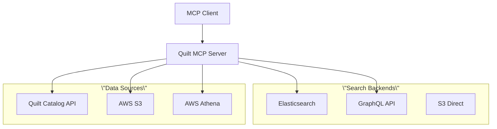
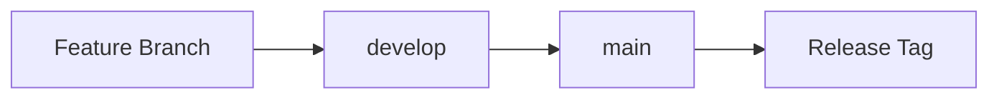

# Quilt MCP Server

A production-ready MCP (Model Context Protocol) server providing secure access to Quilt data with 84+ comprehensive tools
for package management, S3 operations, analytics, and system utilities.

[](https://github.com/quiltdata/quilt-mcp-server/actions/workflows/test.yml)
[](https://github.com/quiltdata/quilt-mcp-server)
[](https://www.python.org/downloads/)
[](LICENSE.txt)

## 🚀 Quick Start

### Installation

#### Option A: Claude Desktop (Recommended)

The easiest way to get started:

1. **Download**: Get the latest `.dxt` from [releases](https://github.com/quiltdata/quilt-mcp-server/releases)
1. **Authenticate**: Run `quilt3 login` so you can access your catalog
    1. May require first setting `quilt3 config your-quilt-catalog.yourcompany.com`
1. **Install**: Double-click the `.dxt` file or use Claude Desktop → Settings → Extensions → Install from File
1. **Configure**: Set your Quilt catalog domain in Claude Desktop → Settings → Extensions → Quilt MCP
1. **Verify**: Open Tools panel in a new chat and confirm Quilt MCP is available

> **Requirements**: Python 3.11+ accessible in your login shell (`python3 --version`)

#### Option B: Local Development

For development or custom configurations:

```bash
# 1. Clone and setup
git clone https://github.com/quiltdata/quilt-mcp-server.git
cd quilt-mcp-server
cp -i env.example .env
# Edit .env with your AWS credentials and Quilt settings

# 2. Install dependencies
uv sync

# 3. Run server (in background)
make run &
SERVER_PID=$!

# 4. Verify that it works
sleep 8
bin/mcp-test.py http://127.0.0.1:8000/mcp/
kill $SERVER_PID
```

#### Option C: IDE Integration

**Cursor Configuration:**

```json
{
  \"mcpServers\": {
    \"quilt\": {
      \"command\": \"/path/to/quilt-mcp-server/.venv/bin/python\",
      \"args\": [\"/path/to/quilt-mcp-server/app/main.py\"],
      \"env\": {
        \"PYTHONPATH\": \"/path/to/quilt-mcp-server/app\",
        \"QUILT_CATALOG_DOMAIN\": \"demo.quiltdata.com\",
        \"QUILT_DEFAULT_BUCKET\": \"s3://your-bucket\"
      }
    }
  }
}
```

**VS Code Configuration:**

```json
{
  \"mcpServers\": {
    \"quilt\": {
      \"command\": \"/path/to/quilt-mcp-server/.venv/bin/python\",
      \"args\": [\"/path/to/quilt-mcp-server/app/main.py\"],
      \"env\": {
        \"PYTHONPATH\": \"/path/to/quilt-mcp-server/app\",
        \"QUILT_CATALOG_DOMAIN\": \"demo.quiltdata.com\"
      },
      \"description\": \"Quilt MCP Server\"
    }
  }
}
```

### Development

1. **Verify Installation**:

   ```bash
   # Check Python version
   python3 --version  # Should be 3.11+
   
   ```

2. **Configure Environment**:

   ```bash
   # Copy example configuration
   cp -i env.example .env
   
   # Edit with your settings
   QUILT_CATALOG_DOMAIN=your-catalog.com
   QUILT_DEFAULT_BUCKET=s3://your-bucket
   AWS_PROFILE=default
   
   # Validate configuration
   scripts/check-env.sh
   ```

3. **Explore Tools**:

   ```bash
   # Test server
   make run
   curl -X POST http://localhost:8000/mcp \\
        -H \"Content-Type: application/json\" \\
        -d '{\"jsonrpc\":\"2.0\",\"id\":1,\"method\":\"tools/list\",\"params\":{}}'
   # Open interactive tool explorer
   cd app && make run-inspector
   # Visit http://127.0.0.1:6274
   ```

## 📚 Documentation

- **[Installation Guide](docs/INSTALLATION.md)** - Detailed setup instructions
- **[Tool Reference](docs/TOOLS.md)** - Complete tool documentation  
- **[Contributing Guide](docs/CONTRIBUTING.md)** - How to contribute
- **[Testing Guide](docs/TESTING.md)** - Testing philosophy and practices
- **[Repository Layout](docs/REPOSITORY.md)** - Project structure
- **[API Reference](docs/API.md)** - MCP protocol details

## 🛠️ Available Tools

This server provides **84+ comprehensive tools** organized into categories:

### 📦 Package Management

- `packages_list` - List packages with filtering and search
- `package_browse` - Explore package contents and structure  
- `package_create` - Create packages from S3 objects
- `package_update` - Update existing packages
- `package_validate` - Validate package integrity
- `create_package_enhanced` - Advanced creation with templates

### 🗄️ S3 Operations  

- `bucket_objects_list` - List and filter S3 objects
- `bucket_object_info` - Get detailed object metadata
- `bucket_object_text` - Read text content from objects
- `bucket_objects_put` - Upload multiple objects
- `bucket_objects_search` - Search using Elasticsearch

### 📊 Analytics & SQL

- `athena_query_execute` - Run SQL queries via Athena
- `athena_databases_list` - List available databases
- `tabulator_tables_list` - Manage Quilt Tabulator tables
- `unified_search` - Multi-backend intelligent search

### 🔐 Authentication & Permissions

- `auth_status` - Check Quilt authentication
- `aws_permissions_discover` - Discover AWS permissions
- `bucket_access_check` - Validate bucket access

### 🔧 Advanced Features

- `workflow_create` - Multi-step workflow management
- `metadata_templates` - Generate metadata (genomics, ML, etc.)
- `generate_quilt_summarize_json` - Create package summaries
- `create_package_from_s3` - Smart S3-to-package conversion

**[View complete tool reference →](docs/TOOLS.md)**

**[Detailed repository layout →](docs/REPOSITORY.md)**

### System Architecture



## 🧪 Testing

We maintain **85%+ test coverage** with comprehensive real-world validation:

### Testing Philosophy

- **Real Data Testing**: Validate with actual Benchling and Quilt data
- **Cross-System Integration**: Test federated search across multiple backends  
- **Performance Validation**: Ensure sub-second response times
- **Error Handling**: Graceful degradation and meaningful error messages

### Test Categories

```bash
# Unit tests (85%+ coverage)
make coverage

# Integration tests  
make test

# Real-world scenarios
python test_cases/sail_user_stories_real_test.py

# Performance benchmarks
python test_cases/mcp_comprehensive_test_simulation.py
```

**[Complete testing guide →](docs/developer/TESTING.md)**

## 🤝 Contributing

We welcome contributions! Please see our [Contributing Guide](docs/developer/CONTRIBUTING.md) for details.

### Quick Contribution Setup

```bash
# 1. Fork and clone
git clone https://github.com/your-username/quilt-mcp-server.git
cd quilt-mcp-server

# 2. Create feature branch
git checkout -b feature/your-feature-name

# 3. Setup development environment
uv sync --group test
make test

# 4. Make changes and test
make coverage
make validate

# 5. Submit PR
git push origin feature/your-feature-name
```

### 🌿 Development Workflow

We use a simplified Git flow with two main branches:



**Branch Strategy:**

- **`main`** - Production-ready code with tagged releases
- **`develop`** - Integration branch for new features
- **Feature branches** - Individual features and fixes

**Process:**

1. **Create feature branch** from `develop`:

   ```bash
   git checkout develop
   git pull origin develop
   git checkout -b feature/your-feature-name
   ```

2. **Develop and test** your changes:

   ```bash
   make test  # Run all checks
   make coverage      # Ensure test coverage
   ```

3. **Submit PR to develop**:

   ```bash
   git push origin feature/your-feature-name
   # Create PR targeting 'develop' branch
   ```

4. **Release process** (maintainers):

   ```bash
   # Merge develop to main for releases
   git checkout main
   git merge develop
   git tag v0.x.x
   git push origin main --tags
   ```

**Branch Naming Convention:**

- `feature/feature-name` - New features
- `fix/issue-description` - Bug fixes  
- `docs/documentation-topic` - Documentation
- `chore/maintenance-task` - Maintenance

### What We're Looking For

- **🐛 Bug Reports**: Clear reproduction steps and expected behavior
- **✨ Feature Requests**: Use cases and implementation suggestions  
- **📚 Documentation**: Improvements to guides and examples
- **🧪 Tests**: Additional test coverage and real-world scenarios
- **🔧 Tools**: New MCP tools for Quilt operations

**[Detailed contribution guidelines →](docs/developer/CONTRIBUTING.md)**

## 📋 Requirements

- **Python 3.11+** and **[uv](https://docs.astral.sh/uv/)** package manager
- **AWS CLI** configured with credentials for S3 access
- **Docker** (optional, for containerization)

> **Claude Desktop Note**: Ensure Python 3.11+ is accessible via `python3` in your login shell, not just virtual environments.

## ⚙️ Configuration

### Environment Variables

```bash
# Required
QUILT_CATALOG_DOMAIN=your-catalog.com
QUILT_DEFAULT_BUCKET=s3://your-bucket
AWS_PROFILE=default

# Optional
QUILT_CATALOG_URL=https://your-catalog.com
AWS_REGION=us-east-1
MCP_SERVER_PORT=8000
```

### Validation

```bash
# Check environment setup
scripts/check-env.sh

# Validate specific client
scripts/check-env.sh claude
```

## 🚀 Usage Examples

### Basic Operations

```python
# List packages
await mcp_client.call_tool(\"packages_list\", {
    \"registry\": \"s3://quilt-example\",
    \"limit\": 10
})

# Search across systems
await mcp_client.call_tool(\"unified_search\", {
    \"query\": \"RNA-seq data from 2024\",
    \"scope\": \"global\",
    \"limit\": 50
})

# Create package
await mcp_client.call_tool(\"create_package_enhanced\", {
    \"name\": \"genomics/study-001\",
    \"files\": [\"s3://bucket/data.vcf\"],
    \"metadata_template\": \"genomics\",
    \"description\": \"Genomic analysis results\"
})
```

### Advanced Workflows

```python
# Multi-step workflow
workflow_id = await mcp_client.call_tool(\"workflow_create\", {
    \"workflow_id\": \"data-processing-001\",
    \"name\": \"Data Processing Pipeline\",
    \"description\": \"Process and package genomic data\"
})

# Execute SQL analysis
results = await mcp_client.call_tool(\"athena_query_execute\", {
    \"query\": \"SELECT * FROM genomics_db.samples WHERE date > '2024-01-01'\",
    \"database_name\": \"genomics_db\"
})
```

## 🔧 Development Commands

```bash
# Core operations
make run                     # Run local server
make test           # Validate setup
make coverage              # Run tests with coverage

# Development tools  
make run-app-tunnel        # Expose via ngrok
cd app && make run-inspector # Open tool explorer

# Testing
make test              # Unit tests
python test_cases/sail_user_stories_real_test.py  # Real data tests

# Deployment (optional)
make build                 # Build Docker image
make deploy               # Deploy to AWS
```

## 📦 Release Management

### Creating Releases

The project follows semantic versioning with automated release workflows:

#### Development Releases (Pre-releases)

Create development tags for testing and internal distribution:

```bash
# Create a development release from current branch
make release-dev
```

This automatically:

- Reads version from `pyproject.toml`
- Creates a timestamped dev tag (e.g., `v0.6.4-dev-20250910212915`)
- Triggers GitHub Actions to build DXT package
- Creates GitHub pre-release with assets

#### Production Releases

Create stable releases from main branch:

```bash
# Create a production release (must be on main branch)  
make release
```

This automatically:

- Reads version from `pyproject.toml`
- Creates a stable tag (e.g., `v0.6.4`)
- Triggers GitHub Actions for full release
- Creates GitHub release with DXT package and documentation

#### Version Bumping

Update versions using convenient make targets:

```bash
# Automated version bumping
make bump-patch       # 0.6.4 → 0.6.5
make bump-minor       # 0.6.4 → 0.7.0  
make bump-major       # 0.6.4 → 1.0.0

# Combined bump + commit + release
make release-patch    # Bump patch, commit, and create release tag
make release-minor    # Bump minor, commit, and create release tag
make release-major    # Bump major, commit, and create release tag

# Manual editing (if needed)
vim pyproject.toml

# Test the release process locally
make release-local  # Builds but doesn't push tags
```

#### Release Validation

All releases undergo automated validation:

```bash
# Local release workflow (no git operations)
make release-local

# Individual release targets for testing
make dxt           # Build DXT package
make dxt-validate  # Validate DXT integrity
make release-zip   # Create release bundle
```

**GitHub Actions** automatically:

1. Runs full test suite (Python 3.11, 3.12, 3.13)
2. Builds and validates DXT package
3. Creates release bundle with documentation
4. Publishes to GitHub Releases

### Release Artifacts

Each release includes:

- **`.dxt` file**: Claude Desktop Extension package
- **`-release.zip`**: Complete release bundle with installation scripts
- **Release notes**: Auto-generated from commit history

### Version Management

- **Single source of truth**: `pyproject.toml` contains authoritative version
- **Semantic versioning**: `MAJOR.MINOR.PATCH` format
- **Development tags**: Include timestamp for uniqueness
- **Pre-release tags**: Support `-rc.1`, `-alpha.1`, `-beta.1` formats

## 🔒 Security

- **IAM Integration**: AWS IAM roles and policies for secure access
- **JWT Authentication**: Support for JWT-based authentication  
- **Minimal Permissions**: Principle of least privilege
- **Secure Defaults**: No secrets in logs or responses
- **Environment Isolation**: Credentials via `.env` files

## 🆘 Troubleshooting

### Common Issues

**Python Version Problems:**

```bash
python3 --version  # Should show 3.11+
which python3     # Should be in PATH
```

**AWS Credential Issues:**

```bash
aws sts get-caller-identity  # Verify AWS access
aws s3 ls s3://your-bucket  # Test S3 permissions
```

**Module Import Errors:**

```bash
export PYTHONPATH=/path/to/quilt-mcp-server/app
cd quilt-mcp-server && make run
```

### Getting Help

- **📖 Documentation**: Check [docs/](docs/) for detailed guides ([Documentation Index](docs/README.md))
- **🔧 Tool Explorer**: Use `make run-inspector` for interactive testing
- **✅ Validation**: Run `make test` for comprehensive checks
- **🐛 Issues**: Report bugs via [GitHub Issues](https://github.com/quiltdata/quilt-mcp-server/issues)

## 📄 License

This project is licensed under the Apache License 2.0 - see the [LICENSE.txt](LICENSE.txt) file for details.

## 🙏 Acknowledgments

- Built on the [Model Context Protocol](https://modelcontextprotocol.io/) specification
- Integrates with [Quilt Data](https://quiltdata.com/) for data package management
- Uses AWS services for scalable data operations
- Tested with real-world bioinformatics workflows from SAIL Biomedicines

---

**Ready to get started?** Follow our [Installation Guide](docs/user/INSTALLATION.md)
or jump right in with the [Quick Start](#-quick-start) above!
