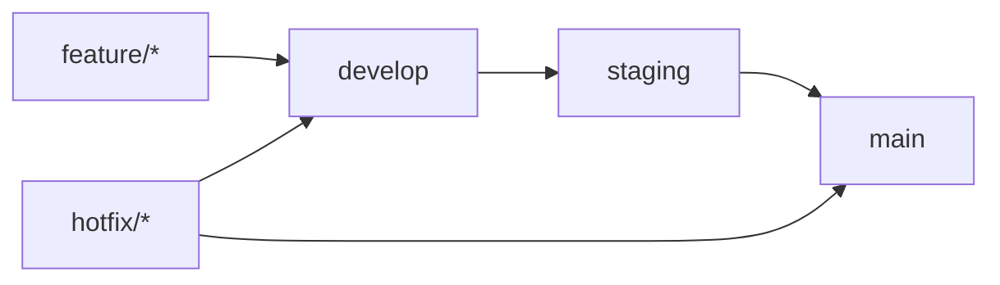

# Git Branching Strategy

This document outlines the branching strategy for the Quilt MCP Server project, ensuring stable production releases while enabling feature development and testing.

## 🌳 Branch Structure

### **Main Branches**

#### `main` (Production)
- **Purpose**: Production-ready, stable code
- **Protection**: 
  - Requires PR reviews
  - No direct pushes
  - Automated testing must pass
- **Updates**: Only from `staging` branch via PR
- **Frequency**: When releases are ready

#### `develop` (Integration)
- **Purpose**: Integration branch for features and nightly builds
- **Protection**: 
  - Requires PR reviews for major changes
  - Automated testing must pass
- **Updates**: From `feature/*` branches via PR
- **Frequency**: Daily integration of completed features

#### `staging` (Pre-production)
- **Purpose**: Pre-production testing and release preparation
- **Protection**: 
  - Requires PR reviews
  - Full test suite must pass
- **Updates**: From `develop` branch via PR
- **Frequency**: Before each release

### **Development Branches**

#### `feature/*` (Feature Development)
- **Naming**: `feature/issue-number-description` (e.g., `feature/33-readme-files`)
- **Purpose**: Individual feature development
- **Source**: `develop` branch
- **Target**: `develop` branch via PR
- **Lifetime**: Until feature is complete and merged

#### `hotfix/*` (Critical Fixes)
- **Naming**: `hotfix/issue-number-description` (e.g., `hotfix/security-vulnerability`)
- **Purpose**: Critical production fixes
- **Source**: `main` branch
- **Target**: Both `main` and `develop` branches
- **Lifetime**: Until fix is deployed

#### `release/*` (Release Preparation)
- **Naming**: `release/version-number` (e.g., `release/v1.2.0`)
- **Purpose**: Final release preparation and testing
- **Source**: `develop` branch
- **Target**: `staging` and `main` branches
- **Lifetime**: Until release is complete

## 🔄 Workflow

### **Daily Development Flow**



### **Feature Development Process**

1. **Create Feature Branch**
   ```bash
   git checkout develop
   git pull origin develop
   git checkout -b feature/issue-number-description
   ```

2. **Develop Feature**
   - Make commits with clear messages
   - Push to remote feature branch
   - Create draft PR early for feedback

3. **Complete Feature**
   - Ensure all tests pass
   - Update documentation
   - Request code review
   - Merge to `develop` via PR

### **Release Process**

1. **Prepare Release**
   ```bash
   git checkout develop
   git checkout -b release/v1.2.0
   # Update version numbers, changelog, etc.
   ```

2. **Test in Staging**
   - Merge to `staging` for testing
   - Run full test suite
   - Fix any issues found

3. **Deploy to Production**
   - Merge to `main` when ready
   - Tag the release
   - Deploy to production

### **Hotfix Process**

1. **Create Hotfix Branch**
   ```bash
   git checkout main
   git checkout -b hotfix/critical-issue
   ```

2. **Fix and Test**
   - Make minimal changes
   - Test thoroughly
   - Create PR to `main`

3. **Deploy and Merge**
   - Merge to `main` immediately
   - Deploy to production
   - Merge to `develop` to prevent regression

## 🚀 CI/CD Integration

### **Branch Protection Rules**

#### `main` Branch
- ✅ Require PR reviews (2 approvals)
- ✅ Require status checks to pass
- ✅ Require branches to be up to date
- ✅ Restrict pushes
- ✅ Require linear history

#### `develop` Branch
- ✅ Require PR reviews (1 approval)
- ✅ Require status checks to pass
- ✅ Allow force pushes (for maintainers)

#### `staging` Branch
- ✅ Require PR reviews (1 approval)
- ✅ Require status checks to pass
- ✅ Require branches to be up to date

### **Automated Testing**

- **Feature Branches**: Run unit tests and basic integration tests
- **Develop Branch**: Run full test suite + security scans
- **Staging Branch**: Run full test suite + performance tests
- **Main Branch**: Run production deployment tests

## 📋 Best Practices

### **Branch Naming**
- Use descriptive names: `feature/33-readme-files-in-metadata`
- Include issue numbers when applicable
- Use lowercase with hyphens

### **Commit Messages**
- Use conventional commit format
- Reference issue numbers
- Keep commits focused and atomic

### **PR Management**
- Create PRs early for feedback
- Use draft PRs for work in progress
- Request reviews from appropriate team members
- Use PR templates for consistency

### **Merging Strategy**
- **Feature → Develop**: Squash and merge
- **Develop → Staging**: Merge commit
- **Staging → Main**: Merge commit
- **Hotfix → Main**: Fast-forward merge when possible

## 🔧 Setup Commands

### **Initial Setup**
```bash
# Create and push main branches
git checkout -b develop
git push -u origin develop

git checkout -b staging
git push -u origin staging

# Return to develop for daily work
git checkout develop
```

### **Daily Workflow**
```bash
# Start new feature
git checkout develop
git pull origin develop
git checkout -b feature/new-feature

# Work on feature...
git add .
git commit -m "feat: add new feature"
git push origin feature/new-feature

# Create PR to develop
# After review and approval, merge to develop
```

### **Release Preparation**
```bash
# Prepare release
git checkout develop
git checkout -b release/v1.2.0
# Make release changes
git commit -m "chore: prepare release v1.2.0"
git push origin release/v1.2.0

# Create PR to staging
# After testing, create PR to main
```

## 📚 Additional Resources

- [Git Flow](https://nvie.com/posts/a-successful-git-branching-model/)
- [GitHub Flow](https://guides.github.com/introduction/flow/)
- [Conventional Commits](https://www.conventionalcommits.org/)
- [Semantic Versioning](https://semver.org/)

## 🆘 Troubleshooting

### **Common Issues**

1. **Branch Out of Date**
   ```bash
   git checkout develop
   git pull origin develop
   git checkout feature/branch
   git rebase develop
   ```

2. **Merge Conflicts**
   ```bash
   git status
   # Resolve conflicts manually
   git add .
   git commit -m "resolve merge conflicts"
   ```

3. **Force Push (Use with caution)**
   ```bash
   git push --force-with-lease origin branch-name
   ```

### **Emergency Procedures**

- **Broken Main**: Revert to last known good commit
- **Broken Develop**: Reset to main and re-apply working features
- **Data Loss**: Contact team lead immediately

---

**Remember**: This strategy is designed to maintain stability while enabling rapid development. Always prioritize code quality and testing over speed.
