# MCP Server Infrastructure Diagram

This document contains the Mermaid diagram showing the complete infrastructure architecture for the Quilt MCP Server deployment within the sales-prod AWS stack.

## Infrastructure Overview

The diagram below illustrates how the MCP Server integrates with the existing Quilt infrastructure, including the ALB, ECS Fargate cluster, ECR repository, and supporting AWS services.

```mermaid
graph TB
    %% External Users
    Users[👥 Users<br/>Frontend & Claude Desktop]
    
    %% Internet Gateway and DNS
    IGW[🌐 Internet Gateway]
    DNS[🌍 Route 53<br/>demo.quiltdata.com]
    
    %% Application Load Balancer
    ALB[⚖️ Application Load Balancer<br/>sales-prod-alb]
    ALB_SG[🛡️ ALB Security Group<br/>Allow HTTPS from Internet]
    
    %% ALB Listener Rules
    MCP_Rule[📋 ALB Listener Rule<br/>Host: demo.quiltdata.com<br/>Path: /mcp/<br/>Priority: 100+]
    
    %% VPC and Networking
    VPC[🏢 VPC: sales-prod<br/>CIDR: 10.0.0.0-16]
    
    %% Public Subnets (for ALB)
    PubSub1[🌐 Public Subnet 1<br/>AZ-a]
    PubSub2[🌐 Public Subnet 2<br/>AZ-b]
    
    %% Private Subnets (for ECS)
    PrivSub1[🔒 Private Subnet 1<br/>AZ-a<br/>10.0.1.0-24]
    PrivSub2[🔒 Private Subnet 2<br/>AZ-b<br/>10.0.2.0-24]
    
    %% Target Groups
    MCP_TG[🎯 Target Group<br/>sales-prod-mcp-server-tg<br/>Protocol: HTTP<br/>Port: 8000<br/>Health: /healthz]
    
    %% ECS Cluster and Service
    ECS_Cluster[🐳 ECS Cluster<br/>sales-prod<br/>Fargate Platform]
    
    MCP_Service[🚀 ECS Service<br/>sales-prod-mcp-server-production<br/>Desired Count: 1<br/>Task Definition: quilt-mcp-server]
    
    MCP_Task[📦 Fargate Task<br/>CPU: 256 units<br/>Memory: 512 MiB<br/>Image: quilt-mcp-server]
    
    MCP_SG[🛡️ MCP Security Group<br/>Allow Port 8000 from ALB]
    
    %% ECR Repository
    ECR[📦 ECR Repository<br/>850787717197.dkr.ecr.us-east-1.amazonaws.com<br/>quilt-mcp-server]
    
    %% IAM Roles
    TaskRole[🔐 ECS Task Role<br/>ecsTaskRole<br/>Quilt AWS Access]
    ExecRole[🔐 ECS Execution Role<br/>ecsTaskExecutionRole<br/>ECR Pull + CloudWatch Logs]
    
    %% CloudWatch Logs
    CW_Logs[📊 CloudWatch Log Group<br/>/ecs/mcp-server-production<br/>Retention: 30 days]
    
    %% AWS Services (Quilt Integration)
    S3[🗄️ Amazon S3<br/>Quilt Buckets]
    Athena[📊 Amazon Athena<br/>Query Service]
    IAM[🔐 AWS IAM<br/>Role Assumption]
    
    %% Flow Connections
    Users --> IGW
    IGW --> DNS
    DNS --> ALB
    ALB --> ALB_SG
    ALB_SG --> MCP_Rule
    MCP_Rule --> MCP_TG
    MCP_TG --> MCP_Service
    
    %% VPC and Subnet Connections
    ALB --> VPC
    VPC --> PubSub1
    VPC --> PubSub2
    VPC --> PrivSub1
    VPC --> PrivSub2
    
    %% ECS and Task Placement
    MCP_Service --> ECS_Cluster
    ECS_Cluster --> PrivSub1
    ECS_Cluster --> PrivSub2
    MCP_Service --> MCP_Task
    MCP_Task --> MCP_SG
    
    %% Security Group Rules
    MCP_SG -.-> ALB_SG
    
    %% IAM Role Assignments
    MCP_Task --> TaskRole
    MCP_Task --> ExecRole
    
    %% Container Image Source
    ECR --> MCP_Task
    
    %% Logging
    MCP_Task --> CW_Logs
    ExecRole --> CW_Logs
    ExecRole --> ECR
    
    %% AWS Service Access
    TaskRole --> S3
    TaskRole --> Athena
    TaskRole --> IAM
    
    %% Styling
    classDef userClass fill:#e1f5fe,stroke:#01579b,stroke-width:2px
    classDef awsClass fill:#fff3e0,stroke:#e65100,stroke-width:2px
    classDef networkClass fill:#f3e5f5,stroke:#4a148c,stroke-width:2px
    classDef securityClass fill:#ffebee,stroke:#b71c1c,stroke-width:2px
    classDef computeClass fill:#e8f5e8,stroke:#1b5e20,stroke-width:2px
    classDef storageClass fill:#fff8e1,stroke:#f57f17,stroke-width:2px
    
    class Users userClass
    class IGW,DNS,ALB,VPC,PubSub1,PubSub2,PrivSub1,PrivSub2,MCP_TG,MCP_Rule networkClass
    class ALB_SG,MCP_SG,TaskRole,ExecRole,IAM securityClass
    class ECS_Cluster,MCP_Service,MCP_Task computeClass
    class ECR,CW_Logs,S3,Athena storageClass
```

## Key Infrastructure Components

### 1. **External Access Layer**
- **Users**: Frontend applications and Claude Desktop clients
- **Internet Gateway**: Entry point for external traffic
- **Route 53**: DNS resolution for `demo.quiltdata.com`

### 2. **Load Balancing Layer**
- **Application Load Balancer**: TLS termination and traffic distribution
- **ALB Security Group**: Controls inbound HTTPS access
- **Listener Rule**: Routes `/mcp/*` traffic to MCP service

### 3. **Networking Layer**
- **VPC**: Isolated network environment (`10.0.0.0/16`)
- **Public Subnets**: Host ALB resources (multi-AZ)
- **Private Subnets**: Host ECS tasks (multi-AZ for high availability)

### 4. **Compute Layer**
- **ECS Cluster**: Fargate-based container orchestration
- **MCP Service**: Managed ECS service with health checks
- **Fargate Tasks**: Containerized MCP server instances
- **Target Group**: Health checks and load balancing

### 5. **Security Layer**
- **Security Groups**: Network-level access control
- **IAM Roles**: AWS service access permissions
- **Private Subnet Deployment**: No direct internet access

### 6. **Storage and Logging Layer**
- **ECR Repository**: Container image storage
- **CloudWatch Logs**: Centralized application logging
- **S3/Athena**: Quilt data services accessed via task role

## Traffic Flow

1. **External Request**: User/application sends HTTPS request to `demo.quiltdata.com/mcp/*`
2. **DNS Resolution**: Route 53 resolves to ALB IP addresses
3. **Load Balancer**: ALB terminates TLS and matches listener rule
4. **Target Group**: Routes request to healthy MCP service instances
5. **ECS Service**: Distributes traffic across available Fargate tasks
6. **MCP Container**: Processes request and accesses AWS services via IAM role
7. **Response**: HTTP response flows back through the same path

## Security Boundaries

### Network Security
- **Internet → ALB**: HTTPS only, security group controlled
- **ALB → ECS**: HTTP within VPC, security group isolation
- **ECS → AWS Services**: IAM role-based access, no internet routing

### Access Control
- **Authentication**: JWT token validation within MCP container
- **Authorization**: IAM role permissions for AWS resource access
- **Network Isolation**: Private subnet deployment prevents direct access

## High Availability Design

### Multi-AZ Deployment
- **ALB**: Spans multiple availability zones
- **ECS Tasks**: Distributed across private subnets in different AZs
- **Target Group**: Health checks ensure traffic only routes to healthy instances

### Health Monitoring
- **ALB Health Checks**: Target group monitors `/healthz` endpoint
- **ECS Health Checks**: Container-level health validation
- **CloudWatch Logs**: Centralized monitoring and alerting

## Integration Points

### Quilt Stack Integration
- **Shared VPC**: Uses existing sales-prod network infrastructure
- **Shared ALB**: Integrates with existing load balancer configuration
- **Shared IAM**: Leverages existing AWS service access patterns

### External Integrations
- **Frontend**: HTTPS endpoint with CORS and JWT authentication
- **Claude Desktop**: Requires FastMCP proxy for stdio transport
- **AWS Services**: S3, Athena, and other Quilt data services
