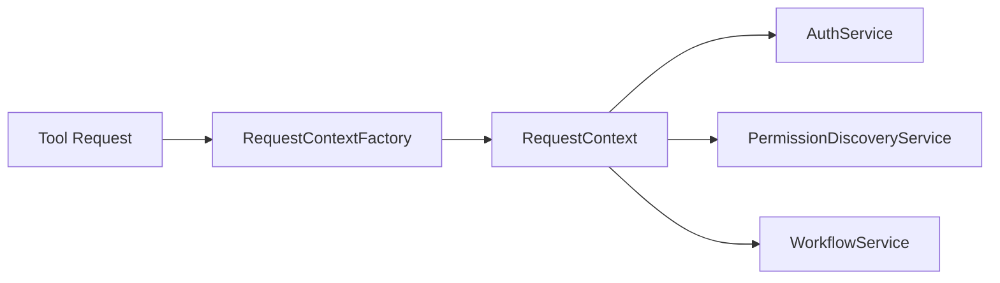

# Request-Scoped Services & Multiuser Isolation

This document describes the request-scoped service architecture, per-request isolation guarantees, and migration guidance for removing module-level singletons.

## Architecture Overview

Request-scoped services are created per MCP tool invocation and carried through a `RequestContext` stored in a context variable.



### Service Lifecycle

- Each tool invocation creates a new `RequestContext`.
- Services are instantiated on demand by `RequestContextFactory`.
- Context is set via `set_current_context()` and cleared in a `finally` block.
- Services are eligible for garbage collection after the request completes.

### Request Isolation Guarantees

- Permission caches are per-request and are not shared between contexts.
- Auth services are created per-request to avoid credential leakage.
- Workflow state is local-dev only and stored on disk per deployment.

## Single-User vs Multiuser Modes

### Single-User Mode (Local Dev)

- Default if `QUILT_MULTIUSER_MODE` is unset or false.
- Uses IAM/quilt3 credentials.
- Stateful features enabled (workflows, templates).

### Multiuser Mode (Production)

- Enable via `QUILT_MULTIUSER_MODE=true`.
- Stateless server (no server-side persistence).
- Catalog-issued JWT required on every request.
- User identity is extracted from JWT `id` or `uuid` claims.

## Environment Configuration

```bash
# Enable multiuser mode
export QUILT_MULTIUSER_MODE=true

# Workflow storage base directory (local dev only)
export QUILT_WORKFLOW_DIR=~/.quilt/workflows
```

## API Reference (Key Interfaces)

### RequestContext

- Fields: `request_id`, `user_id`, `auth_service`, `permission_service`, `workflow_service`
- Helpers:
  - `get_boto_session()`
  - `discover_permissions(...)`
  - `check_bucket_access(...)`
  - `create_workflow(...)`, `add_workflow_step(...)`, `update_workflow_step(...)`
  - `get_workflow_status(...)`, `list_workflows()`

### RequestContextFactory

- `create_context(request_id: Optional[str] = None)`
- Mode detection: `single-user`, `multiuser`, or `auto` (via env)
- User extraction: `extract_user_id(...)` helper

### Context Propagation

- `set_current_context(context)`
- `get_current_context()`
- `reset_current_context(token)`

### Service Interfaces

- `AuthService`: `get_session()`, `is_valid()`, `get_user_identity()`
- `PermissionDiscoveryService`: request-scoped cache, uses auth session
- `WorkflowService`: local-dev CRUD operations via filesystem storage

## Migration Guide

### Phase-by-Phase Approach

1. Replace module-level auth singleton with request-scoped `AuthService`.
2. Replace permission discovery singleton with request-scoped service.
3. Replace workflow singleton with filesystem-backed `WorkflowService` (local dev only).
4. Enforce JWT-only auth for multiuser mode.

### Rollback Procedure

- Revert the latest phase commit.
- Remove new context integration points.
- Restore singleton accessors (if required).

## Testing Strategy

- Unit tests cover per-request instantiation, validation, and helper delegation.
- Integration tests validate stateless multiuser behavior and request isolation.
- Security tests validate JWT-only auth and rejection of unsupported claims.
- Load tests validate context creation under high concurrency.

## Performance Considerations

- Context creation should remain under 10ms per request.
- Workflow persistence uses atomic file writes to avoid corruption.
- Avoid heavy work in context creation; initialize services lazily when possible.

## Troubleshooting

- **Missing JWT in multiuser mode**: ensure `Authorization: Bearer <token>` is sent.
- **Unexpected access errors**: verify each request receives a fresh context and services are not cached globally.
- **Workflow not found (local dev)**: confirm workflow ID and storage directory are correct.
