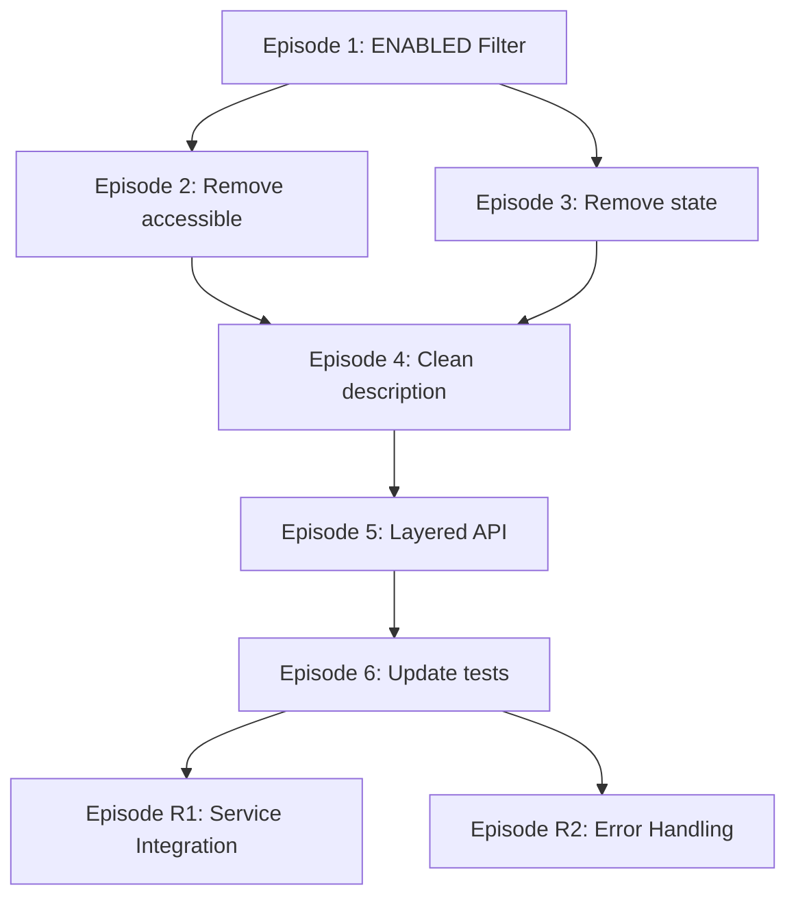

<!-- markdownlint-disable MD013 -->
# Phase 1 Episodes: Enhanced Athena Workgroups Listing Implementation

**Issue #133**  
**Branch:** `133-bug-fail-athena_workgroups_list`  
**Episodes Date:** 2025-09-10  
**Phase:** 1 of 1

## Episode Breakdown Using I RASP DECO Methodology

### Episode 1: Add ENABLED State Filter
**Category:** Infrastructure  
**Type:** Atomic Change Unit  
**Dependencies:** None

#### Red Phase (Failing Test)
```python
def test_athena_workgroups_list_filters_enabled_only():
    """Should only return workgroups with State == 'ENABLED'"""
    # Mock ListWorkGroups returning both ENABLED and DISABLED
    # Assert only ENABLED workgroups in final result
```

#### Green Phase (Minimal Implementation)
- Add filter `State == "ENABLED"` to ListWorkGroups response processing
- Modify workgroup list iteration to skip DISABLED workgroups

#### Refactor Phase (Structure Assessment)
- Assess if filter logic is clear and maintainable
- Consider extracting filter to helper function if beneficial

#### Success Criteria
- [ ] Only ENABLED workgroups appear in results
- [ ] DISABLED workgroups are filtered out before GetWorkGroup calls
- [ ] All existing tests pass
- [ ] No change to public API response structure

#### Commit Messages
- Red: `test: Add BDD test for ENABLED workgroup filtering`
- Green: `feat: Filter workgroups to ENABLED state only`
- Refactor: `refactor: Clean up workgroup filtering logic` (if needed)

---

### Episode 2: Remove Synthetic `accessible` Field
**Category:** API Simplification  
**Type:** Atomic Change Unit  
**Dependencies:** Episode 1

#### Red Phase (Failing Test)
```python
def test_athena_workgroups_list_no_synthetic_accessible_field():
    """Should not include synthetic 'accessible' field in response"""
    # Assert 'accessible' field is not present in any workgroup result
```

#### Green Phase (Minimal Implementation)
- Remove `accessible` field creation logic
- Remove sorting by `accessible` field
- Ensure response contains only AWS API fields

#### Refactor Phase (Structure Assessment)
- Assess if response structure is clean and consistent
- Consider if field removal improves code clarity

#### Success Criteria
- [ ] No `accessible` field in response
- [ ] No sorting by `accessible` field
- [ ] Response structure matches AWS API fields
- [ ] All tests pass with updated assertions

#### Commit Messages
- Red: `test: Add BDD test ensuring no synthetic accessible field`
- Green: `feat: Remove synthetic accessible field from workgroups`
- Refactor: `refactor: Simplify workgroup response structure` (if needed)

---

### Episode 3: Remove `state` Field from Output
**Category:** API Simplification  
**Type:** Atomic Change Unit  
**Dependencies:** Episode 1, Episode 2

#### Red Phase (Failing Test)
```python
def test_athena_workgroups_list_no_state_field_in_output():
    """Should not include 'state' field since all results are ENABLED"""
    # Assert 'state' field is not present in workgroup results
```

#### Green Phase (Minimal Implementation)
- Remove `state` field from response structure
- Update response building to exclude state information

#### Refactor Phase (Structure Assessment)
- Assess if response is cleaner without redundant state field
- Consider if documentation needs updating for field removal

#### Success Criteria
- [ ] No `state` field in response (all workgroups are ENABLED by Episode 1)
- [ ] Response structure simplified
- [ ] All tests pass with updated assertions

#### Commit Messages
- Red: `test: Add BDD test ensuring no state field in output`
- Green: `feat: Remove redundant state field from workgroups response`
- Refactor: `refactor: Clean up response field structure` (if needed)

---

### Episode 4: Remove Error Messages from Description Field
**Category:** Data Integrity  
**Type:** Atomic Change Unit  
**Dependencies:** Episode 1, Episode 2, Episode 3

#### Red Phase (Failing Test)
```python
def test_athena_workgroups_list_clean_description_field():
    """Description field should contain only AWS data, no error messages"""
    # Mock GetWorkGroup failure scenarios
    # Assert description field contains AWS data or remains unchanged
```

#### Green Phase (Minimal Implementation)
- Remove error message injection into `description` field
- Preserve original AWS `Description` field value
- Handle GetWorkGroup failures without polluting description

#### Refactor Phase (Structure Assessment)
- Assess if error handling is clean and maintainable
- Consider if logging level is appropriate for troubleshooting

#### Success Criteria
- [ ] Description field never contains error messages
- [ ] Original AWS Description field preserved
- [ ] GetWorkGroup failures logged but not exposed to users
- [ ] All tests pass with clean description assertions

#### Commit Messages
- Red: `test: Add BDD test for clean description field handling`
- Green: `feat: Remove error messages from workgroup description field`
- Refactor: `refactor: Clean up description field handling` (if needed)

---

### Episode 5: Implement Layered API Access Pattern
**Category:** Service Architecture  
**Type:** Atomic Change Unit  
**Dependencies:** Episode 1, Episode 2, Episode 3, Episode 4

#### Red Phase (Failing Test)
```python
def test_athena_workgroups_list_layered_api_access():
    """Should work with ListWorkGroups only, enhance with GetWorkGroup when available"""
    # Test minimal permissions scenario (ListWorkGroups only)
    # Test enhanced permissions scenario (both APIs)
    # Assert core functionality in both cases
```

#### Green Phase (Minimal Implementation)
- Implement core functionality using ListWorkGroups only
- Add optional enhancement using GetWorkGroup when available
- Handle GetWorkGroup failures gracefully without affecting core results

#### Refactor Phase (Structure Assessment)
- Assess if layered access pattern is clear and maintainable
- Consider if error handling separation is effective

#### Success Criteria
- [ ] Core functionality works with minimal permissions
- [ ] Enhancement works when permissions available
- [ ] GetWorkGroup failures don't break core functionality
- [ ] Logging provides diagnostic information

#### Commit Messages
- Red: `test: Add BDD tests for layered API access pattern`
- Green: `feat: Implement layered API access for workgroups listing`
- Refactor: `refactor: Clean up layered API access implementation` (if needed)

---

### Episode 6: Update Test Assertions
**Category:** Test Maintenance  
**Type:** Atomic Change Unit  
**Dependencies:** Episode 1, Episode 2, Episode 3, Episode 4, Episode 5

#### Red Phase (Failing Test)
```python
def test_athena_workgroups_list_updated_assertions():
    """All test assertions should reflect new response structure"""
    # Update all existing test assertions
    # Remove checks for removed fields
    # Add checks for clean AWS field structure
```

#### Green Phase (Minimal Implementation)
- Update all test assertions in TestAthenaWorkgroupsList class
- Remove assertions for `accessible` and `state` fields
- Add assertions for clean description field
- Update mock scenarios for layered API access

#### Refactor Phase (Structure Assessment)
- Assess if test coverage is comprehensive
- Consider if test organization could be improved

#### Success Criteria
- [ ] All tests pass with updated assertions
- [ ] Test coverage maintained or improved
- [ ] BDD scenarios cover both minimal and enhanced permissions
- [ ] Clean data assertions in place

#### Commit Messages
- Red: `test: Update failing assertions for new response structure`
- Green: `test: Fix all workgroups list test assertions`
- Refactor: `test: Clean up and organize workgroups test cases` (if needed)

---

## Optional Refactoring Episodes

### Episode R1: AthenaQueryService Integration (Optional)
**Category:** Service Consolidation  
**Type:** Refactoring Episode  
**Dependencies:** All core episodes complete

#### Assessment Phase
- Evaluate if AthenaQueryService integration would improve maintainability
- Consider impact on authentication patterns
- Assess effort vs. benefit ratio

#### Implementation Phase (if beneficial)
- Add workgroup methods to AthenaQueryService
- Update athena_workgroups_list to use consolidated service
- Ensure authentication patterns remain consistent

#### Success Criteria
- [ ] Consolidated authentication patterns across Athena tools
- [ ] No breaking changes to public API
- [ ] All tests pass with refactored implementation

---

### Episode R2: Service-Level Error Handling Improvements (Optional)
**Category:** Error Handling Enhancement  
**Type:** Refactoring Episode  
**Dependencies:** All core episodes complete

#### Assessment Phase
- Evaluate current error handling patterns across Athena tools
- Consider standardizing error logging and reporting
- Assess opportunities for improved diagnostics

#### Implementation Phase (if beneficial)
- Standardize error handling patterns
- Improve diagnostic logging consistency
- Enhance error context for troubleshooting

#### Success Criteria
- [ ] Consistent error handling across Athena tools
- [ ] Enhanced diagnostic capabilities
- [ ] No impact on user-facing functionality

---

## Episode Sequencing and Dependencies



## TDD Cycle Management

### Red → Green → Refactor Discipline
Each episode follows strict TDD:

1. **Red Phase:** Write failing test first, commit as "test: ..."
2. **Green Phase:** Minimal implementation to pass, commit as "feat: ..." or "fix: ..."
3. **Refactor Phase:** Assess and improve if beneficial, commit as "refactor: ..."

### Working State Maintenance
- Each episode maintains working state
- All tests pass after each episode completion
- No broken intermediate states
- Independent testability for each atomic change

### Commit Strategy
- Separate commits for Red, Green, and Refactor phases
- Clear commit messages following conventional commits
- Each episode results in 1-3 commits maximum
- Push after each complete episode for CI validation

## Success Validation

### After Each Episode
- [ ] All existing tests pass
- [ ] New BDD tests pass
- [ ] IDE diagnostics clean
- [ ] Working state maintained

### After All Episodes
- [ ] No synthetic fields in response
- [ ] Only ENABLED workgroups returned
- [ ] Clean AWS field structure preserved
- [ ] Layered API access working
- [ ] Enhanced diagnostic logging in place
- [ ] 100% test coverage maintained