# Unified MCP Authentication Architecture Diagram

## Overview

This diagram illustrates the unified authentication architecture for Quilt's MCP server, showing how both web and desktop clients authenticate through a single remote server.

## Architecture Diagram

```mermaid
graph TB
    %% Client Types
    subgraph "Client Layer"
        WebClient[🌐 Web Client<br/>Browser-based<br/>JWT Token]
        DesktopClient[💻 Desktop Client<br/>Claude/Cursor/VS Code<br/>quilt3 Credentials]
    end

    %% Authentication Sources
    subgraph "Authentication Sources"
        QuiltFrontend[🔐 Quilt Frontend<br/>JWT Issuer<br/>OAuth2 Provider]
        QuiltDesktop[🔑 Quilt Desktop<br/>quilt3 login<br/>AWS Credentials]
    end

    %% MCP Server
    subgraph "MCP Server (AWS ECS)"
        MCPMiddleware[🛡️ MCP Middleware<br/>Request Processing<br/>Header Extraction]
        
        subgraph "Unified Authentication Service"
            AuthDetector[🔍 Client Type Detector<br/>Web vs Desktop]
            JWTParser[📋 JWT Parser<br/>Token Validation<br/>Claims Extraction]
            DesktopAuth[💻 Desktop Auth<br/>quilt3 Credentials<br/>AWS Extraction]
            CredManager[🔐 Credential Manager<br/>AWS Session Factory<br/>Refresh Logic]
        end
        
        subgraph "Tool Categories"
            S3Tools[🗄️ S3 Tools<br/>bucket_objects_list<br/>bucket_object_info<br/>bucket_objects_put]
            PackageTools[📦 Package Tools<br/>package_create<br/>package_update<br/>package_browse]
            AthenaTools[📊 Athena Tools<br/>athena_query_execute<br/>athena_databases_list<br/>athena_tables_list]
            SearchTools[🔍 Search Tools<br/>unified_search<br/>packages_search]
            PermissionTools[🔐 Permission Tools<br/>aws_permissions_discover<br/>bucket_access_check]
        end
    end

    %% AWS Services
    subgraph "AWS Services"
        S3[🗄️ Amazon S3<br/>Bucket Operations<br/>Object Storage]
        Athena[📊 Amazon Athena<br/>Query Execution<br/>Data Analysis]
        Glue[🔗 AWS Glue<br/>Data Catalog<br/>Table Discovery]
        IAM[🔐 AWS IAM<br/>Permission Discovery<br/>Role Management]
    end

    %% Quilt Services
    subgraph "Quilt Services"
        QuiltAPI[🌐 Quilt API<br/>Package Management<br/>Search Operations]
        QuiltRegistry[📋 Quilt Registry<br/>Package Metadata<br/>User Management]
    end

    %% Authentication Flows
    WebClient -->|Authorization: Bearer JWT| MCPMiddleware
    DesktopClient -->|quilt3 credentials| MCPMiddleware
    
    QuiltFrontend -->|JWT with AWS Role| WebClient
    QuiltDesktop -->|AWS Credentials| DesktopClient

    %% MCP Server Processing
    MCPMiddleware --> AuthDetector
    AuthDetector -->|Web Client| JWTParser
    AuthDetector -->|Desktop Client| DesktopAuth
    
    JWTParser -->|Extract AWS Role/Creds| CredManager
    DesktopAuth -->|Extract AWS Creds| CredManager
    
    CredManager -->|AWS Session| S3Tools
    CredManager -->|AWS Session| PackageTools
    CredManager -->|AWS Session| AthenaTools
    CredManager -->|Quilt API| SearchTools
    CredManager -->|AWS Session| PermissionTools

    %% Tool to Service Mapping
    S3Tools --> S3
    PackageTools --> S3
    PackageTools --> QuiltAPI
    AthenaTools --> Athena
    AthenaTools --> Glue
    SearchTools --> QuiltAPI
    PermissionTools --> IAM

    %% Styling
    classDef clientClass fill:#e1f5fe,stroke:#01579b,stroke-width:2px
    classDef authClass fill:#fff3e0,stroke:#e65100,stroke-width:2px
    classDef mcpClass fill:#f3e5f5,stroke:#4a148c,stroke-width:2px
    classDef toolClass fill:#e8f5e8,stroke:#1b5e20,stroke-width:2px
    classDef awsClass fill:#fff8e1,stroke:#f57f17,stroke-width:2px
    classDef quiltClass fill:#fce4ec,stroke:#880e4f,stroke-width:2px

    class WebClient,DesktopClient clientClass
    class QuiltFrontend,QuiltDesktop authClass
    class MCPMiddleware,AuthDetector,JWTParser,DesktopAuth,CredManager mcpClass
    class S3Tools,PackageTools,AthenaTools,SearchTools,PermissionTools toolClass
    class S3,Athena,Glue,IAM awsClass
    class QuiltAPI,QuiltRegistry quiltClass
```

## Key Components

### 1. Client Layer
- **Web Client**: Browser-based clients using JWT tokens
- **Desktop Client**: Claude Desktop, Cursor, VS Code using quilt3 credentials

### 2. Authentication Sources
- **Quilt Frontend**: Issues JWT tokens with AWS role information
- **Quilt Desktop**: Provides AWS credentials via quilt3 login

### 3. MCP Server Components
- **MCP Middleware**: Processes incoming requests and extracts authentication
- **Client Type Detector**: Identifies web vs desktop clients
- **JWT Parser**: Validates and extracts information from JWT tokens
- **Desktop Auth**: Handles quilt3 credential processing
- **Credential Manager**: Creates AWS sessions and manages credential refresh

### 4. Tool Categories
- **S3 Tools**: Direct AWS S3 operations
- **Package Tools**: Quilt package management (requires both S3 and Quilt API)
- **Athena Tools**: AWS Athena and Glue operations
- **Search Tools**: Quilt API search operations
- **Permission Tools**: AWS IAM permission discovery

### 5. External Services
- **AWS Services**: S3, Athena, Glue, IAM for data operations
- **Quilt Services**: API and Registry for package management

## Authentication Flow

### Web Client Flow
1. **User logs in** to Quilt frontend
2. **Frontend issues JWT** with AWS role information
3. **Web client sends** JWT in Authorization header
4. **MCP middleware** extracts JWT and detects web client
5. **JWT parser** validates token and extracts AWS role/credentials
6. **Credential manager** creates AWS session
7. **Tools execute** with AWS session

### Desktop Client Flow
1. **User runs** `quilt3 login` locally
2. **quilt3 stores** AWS credentials locally
3. **Desktop client** passes credentials to MCP server
4. **MCP middleware** detects desktop client
5. **Desktop auth** processes quilt3 credentials
6. **Credential manager** creates AWS session
7. **Tools execute** with AWS session

## Benefits

### 1. Unified Architecture
- **Single MCP server** for both client types
- **Consistent authentication** patterns
- **Shared tool implementations**

### 2. Security
- **AWS credentials** as single source of truth
- **Principle of least privilege** enforced
- **Audit trail** for all operations

### 3. Maintainability
- **Single codebase** for authentication
- **Consistent error handling**
- **Unified testing** approach

### 4. Performance
- **Credential caching** and refresh
- **Efficient AWS session** management
- **Optimized tool execution**

## Implementation Phases

### Phase 1: Core Service
- Implement unified authentication service
- Add JWT processing enhancements
- Create tool authentication helpers

### Phase 2: Tool Migration
- Migrate all tool categories
- Add comprehensive testing
- Validate security and performance

### Phase 3: Desktop Integration
- Implement desktop client support
- Add credential passing via MCP
- Update client configurations

### Phase 4: Optimization
- Performance tuning
- Security validation
- Documentation and monitoring
